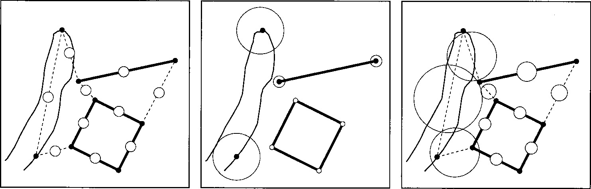

Datakwaliteit
=============

De BGT kent een normkwaliteit en een gerealiseerde kwaliteit. De normkwaliteit
geldt in principe generiek en per object. De gerealiseerde kwaliteit geldt
uitsluitend per plaatsbepalingspunt.

De normkwaliteit wordt beschreven met:

-   Actualiteit;

-   Positionele nauwkeurigheid;

-   Volledigheid;

-   Logische consistentie;

-   Tijd, onderverdeeld in:

-   Nauwkeurigheid;

-   Consistentie;

-   Geldigheid;

-   Thematische nauwkeurigheid (juistheid).

De vermelde waarden voor kwaliteit zijn minimumwaarden. Dat wil zeggen dat de
aspecten van de BGT daar minimaal aan moeten voldoen. Betere waarden zijn altijd
toegestaan.

Actualiteit
===========

Actualiteit is de mate waarin de gegevens binnen een gedefinieerd tijdsinterval
overeenstemmen met de werkelijke situatie.

### Relatie actualiteit en bijhoudingsfrequentie

Om een vastgestelde actualiteit van een bestand als de BGT te kunnen garanderen
moet de inwinning en het verwerkingsproces daarvan met een hogere frequentie
plaatsvinden. Neem als voorbeeld dat een object een dag na een terreinopname
wijzigt. Als er pas na zes maanden een nieuwe inwinning plaatsvindt, zou de
actualiteit al zijn overschreden, terwijl het verwerkingsproces van de
inwinning nog moet plaatsvinden. Een ander voorbeeld, luchtfoto’s. Deze worden
met een bijhoudingsfrequentie van 12 maanden gevlogen. Daarna volgt de
verwerking van de luchtfoto’s en de aanpassing van de BGT op basis van de
luchtfoto’s. De verwerkingsperiode is zes maanden. Dit levert dan een
actualiteit van 18 maanden op.

Positionele nauwkeurigheid
--------------------------

De BGT stelt eisen aan de positionele nauwkeurigheid, waarmee een object wordt
ingewonnen en vastgelegd. Onder positionele nauwkeurigheid verstaat men de mate
waarin de opgeslagen coördinaten overeenkomen met de waarden in de werkelijkheid
of de geaccepteerde afwijking. De positionele nauwkeurigheid in de BGT is de
combinatie van precisie en betrouwbaarheid, ook wel geometrische nauwkeurigheid
genoemd.

De positionele nauwkeurigheid van een object wordt beschreven op het niveau van
het objecttype. Hiermee wordt aan elk object binnen dat objecttype een
nauwkeurigheidseis gesteld. De BGT hanteert voor het beschrijven van de
positionele nauwkeurigheid de relatieve precisie. Een uitgebreide theoretische
beschrijving hiervan staat in het Handboek Technische Werkzaamheden van het
Kadaster uit 1996 (HTW 1996). Bij de precisiebeschrijving wordt
onderscheid gemaakt tussen de relatieve precisie van coördinaten ten gevolge van
de ontstaanswijze (het meet-en verwerkingsproces) en de idealisatie. Toepassing
van het meet- en verwerkingsproces levert de vereiste minimumwaarde op.
Relatieve precisie geldt alleen voor nabijgelegen punten.

Hieronder staan de waarden voor de minimale toegestane kwaliteit voor de
positionele nauwkeurigheid van 30 en 60 cm. Het zijn afrondingen van de in de
HTW 1996 vermelde waarden voor de lengte van de halve lange as van de relatieve
standaardellips tussen twee punten in.

-   Objecten met een hoge positionele nauwkeurigheid: 20 cm x √2 = 28,3 cm,
    afgerond: 30 cm;

-   Objecten met een lage positionele nauwkeurigheid: 40 cm x √2 = 56,6 cm,
    afgerond: 60 cm.

De punten in het veld dienen te zijn ingemeten en in het bestand te zijn
verwerkt volgens de regels, zoals beschreven in de HTW van 1996, inclusief het
supplement voor detailmeten met GPS.

De tabel hieronder vermeldt de minimale waarden van de toegestane kwaliteit voor
de positionele nauw­keu­rig­heid per objecttype. In de laatste kolom staan de
waarden voor idealisatie per objecttype. Een bronhouder is volledig vrij om voor
zijn eigen objecten hogere nauwkeurigheidseisen te hanteren dan voor de BGT zijn
vereist.

Omdat de BGT bestaat uit een verzameling objecten wordt in de tabel per object
een generieke waarde voor de maximaal toegestane afwijking vermeld tussen
nabijgelegen punten met dezelfde idealisatiewaarden en van hetzelfde object.

| BGT-object              | Type           | Actualiteit van object in maanden | Positionele nauwkeurigheid tussen punten van object in cm | Idealisatie per punt van object in cm |
|-------------------------|----------------|-----------------------------------|-----------------------------------------------------------|---------------------------------------|
| Wegdeel                 |                | 6                                 | 30                                                        | 2 – 5                                 |
|                         |                |                                   |                                                           |                                       |
| Onderst. wegdeel        |                | 18                                | 30                                                        | 5 - 10                                |
|                         |                |                                   |                                                           |                                       |
| Spoor                   |                | 18                                | 30                                                        | 2 – 5                                 |
|                         |                |                                   |                                                           |                                       |
| Onbegr. terreindeel     |                | 18                                | 60                                                        | ≥ 10                                  |
|                         |                |                                   |                                                           |                                       |
| Begroeid terreindeel    |                | 18                                | 60                                                        | ≥ 10                                  |
|                         |                |                                   |                                                           |                                       |
| Waterdeel               |                | 18                                | 60                                                        | ≥ 10                                  |
|                         |                |                                   |                                                           |                                       |
| Ondersteunend waterdeel |                | 18                                | 60                                                        | ≥ 10                                  |
|                         |                |                                   |                                                           |                                       |
| Pand                    |                | 6                                 | 30                                                        | 0 – 2                                 |
|                         |                |                                   |                                                           |                                       |
| Overig bouwwerk         | Bassin         | 18                                | 60                                                        | ≥ 10                                  |
|                         | Bezinkbak      | 18                                | 30                                                        | 2 – 5                                 |
|                         | Lage trafo     | 18                                | 30                                                        | 0 – 2                                 |
|                         | Open loods     | 18                                | 30                                                        | 0 – 2                                 |
|                         | Opslagtank     | 18                                | 30                                                        | 2 – 5                                 |
|                         | Overkapping    | 18                                | 30                                                        | 0 - 2                                 |
|                         |                |                                   |                                                           |                                       |
| Overbruggingsdeel       |                | 6                                 | 30                                                        | 0 – 2                                 |
|                         |                |                                   |                                                           |                                       |
| Tunneldeel              |                | 6                                 | 30                                                        | 0 – 2                                 |
|                         |                |                                   |                                                           |                                       |
| Kunstwerkdeel           |                | 18                                | 30                                                        | 0 – 2                                 |
|                         |                |                                   |                                                           |                                       |
| Scheiding               | Muur           | 18                                | 30                                                        | 0 – 2                                 |
|                         | Kademuur       | 18                                | 30                                                        | 0 – 2                                 |
|                         | Geluidsscherm  | 18                                | 30                                                        | 5 – 10                                |
|                         | Damwand        | 18                                | 30                                                        | 5 - 10                                |
|                         | Walbescherming | 18                                | 60                                                        | ≥ 10                                  |
|                         | Hek            | 18                                | 60                                                        | ≥ 10                                  |
|                         |                |                                   |                                                           |                                       |

Tabel 1 Per objecttype generieke waarden voor actualiteit, positionele
nauwkeurigheid en idealisatie

**Precisie** De mate waarin een meet- en verwerkingsproces bij herhaling
dezelfde resul­ta­ten geeft noemt men precisie. Als een hoge precisie wordt
gehaald, betekent het dat de mogelijke fout een kleine waarde heeft. Precisie is
het resultaat van inwinning en verwerking. Dat betekent dat een hoge precisie
bij de inwinning vaak ‘verslechtert’ door inpassing in een bestaand bestand. Zo
zal een terrestrische inwinning die is aangesloten op een fotogrammetrisch
ingewonnen bestand, de precisie verkrijgen die geldt voor het bestaande,
fotogrammetrisch ingewonnen be­stand. Mede om deze reden worden vaak grotere
mutaties (uitbreidingsgebieden), na con­trole op de betrouwbaarheid van de
meting door analyse van een eerste fase ver­ef­fe­ning, geplaatst binnen het
bestaande bestand en niet daarop ingepast. Dit is ook bekend onder de term
“dumpen”.

**Betrouwbaarheid** De mate waarin de ligging van een punt is gecontroleerd
noemt men betrouwbaarheid. De ligging van een punt is weliswaar door één meting
bepaald, maar nog niet gecontroleerd. Een tweede, onafhankelijke meting
controleert de eerste, waardoor men meer zekerheid heeft over de ligging van het
punt. De BGT vermeldt geen waarde voor betrouwbaarheid.

**Idealisatie** Een aspect dat bij het inmeten (herkennen) van punten in het
veld een belangrijke rol speelt, is idealisatie. De idealisatieprecisie is de
precisie waarmee in het terrein een punt kan worden aangewezen, het idealiseren
van een punt. Goede idealiseerbare punten zijn bijvoorbeeld hoeken van panden,
slecht idealiseerbaar bijvoorbeeld de kant van een sloot. De idealisatieprecisie
is onafhankelijk van het gevolgde meet- en verwerkingsproces en is een absoluut
precisiekenmerk van een punt. De waarden voor idealisatie gelden daarom per punt
per objecttype en staan vermeld in de overzichttabel.

### Relatie Nauwkeurigheid – precisie en plaatsbepalingspunten

De hierboven opgenomen tabel vermeldt een generiek waarde voor de minimale
toegestane positionele nauwkeurigheid (de relatieve precisie) tussen nabij
gelegen punten van één object met dezelfde idealisatie. In de praktijk zal één
BGT-object meestal bestaan uit punten met verschillende waarden voor precisie én
idealisatie. Als men tussen deze punten of tussen nabijgelegen punten van
verschillende objecten wil toetsen, moet men eerst de maximaal toegestane
afwijking berekenen als resultaat van de gerealiseerde precisie van de
betreffende plaatsbepalingspunten én de idealisatieprecisie die geldt voor de
objecten waar deze punten deel van uit maken. Het proces daarvan is uitgebreid
beschreven in de HTW 1996.

*a: puntprecisie b: idealisatieprecisie c: resulterende relatieve precisie*

Als men punten over grotere afstand met elkaar wil vergelijken, moet men
rekening houden met de fouten­invloed van het gehanteerde referentiesysteem. In
Nederland is dat het stelsel van de Rijksdriehoeksmeting (RD; zie paragraaf
3.5). Toepassing van geschikte positiebepaling met behulp van satellieten (GPS,
Glonass) levert als eerste resultaat ruimtelijke coördinaten op in ETRS89. Vaak
wordt dit gezien als een ‘absoluut’ coördinaatsysteem. Om daaruit RD-coördinaten
te verkrijgen moet men in Nederland altijd een transformatie uitvoeren met de
geldige versie van RDNAPTRANS[^1].

[^1]: Zie www.rdnap.nl

Volledigheid
------------

Onder volledigheid verstaat men de mate waarin BGT-objecten die in werkelijkheid
voorkomen in het bestand zijn opgenomen. Voor alle vlakobjecten op
maaiveldniveau in de BGT geldt per bronhouder een volledigheidseis van 100%.
Voor alle overige objecten geldt een volledigheidseis van 98%. Het percentage
heeft betrekking op het aantal objecten per bronhouder. Daarnaast geldt dat op
maaiveldniveau de objecten samen 100% dekkend zijn (zie paragraaf 2.4 en 3.7).

Logische consistentie
---------------------

Als de BGT volledig is gevuld, is het op maaiveldniveau (niveau 0) voor
Nederland gebiedsdekkend. Regels voor de logische consistentie zijn al
beschreven in paragraaf 3.7.

Tijd
----

De BGT hanteert de ISO 8601 norm voor het beschrijven van tijdsaspecten. De BGT
registreert de volgende tijden:

-   een objectBeginTijd en een objectEindTijd. Dat zijn attributen die de datum
    beschrijven waarop het object wordt geregistreerd, respectievelijk ongeldig
    wordt. Regels wanneer een object zo verandert dat er sprake is van een nieuw
    BGT object of een nieuwe versie van hetzelfde object, staan beschreven in
    paragraaf 3.10.4.

-   tijdstipRegistratie en eindRegistratie: deze attributen beschrijven het
    tijdstip waarop een versie van het object ontstaat, respectievelijk ongeldig
    wordt. Als een mutatie niet resulteert in een nieuw object, dan ontstaat een
    nieuwe versie van het object. In deze situatie ontstaat een eindRegistratie
    van de vervallen versie en een tijdstipRegistratie van de nieuwe versie van
    het object, terwijl de objectBeginTijd gelijk blijft.

-   LV-publicatiedatum: het tijdstip waarop een versie van een object in de
    Landelijke Voorziening is geregistreerd.

-   datumInwinning bij Plaatsbepalingspunt.

De notatie van de tijd is overeenkomstig de ISO-regelgeving:
jjjj-mm-ddTuu:mm:ss. De hoofdletter T wordt gebruikt om de datum- en
tijdcomponent te scheiden. Een voorbeeld: 2011-10-13T10:47:48 betekent dus 13
oktober 2011 om 10 uur 47 minuten en 48 seconden.

De kwaliteit van de tijdbeschrijving wordt beschreven met drie aspecten, te
weten tijdnauwkeurigheid, tijdconsistentie en tijdgeldigheid.

### Tijdnauwkeurigheid

Met tijdnauwkeurigheid wordt bedoeld de juistheid van de tijdswaarneming. Dit
geeft de foutmarge aan in de tijdswaarneming. De BGT legt objectlevensduur vast
met de nauwkeurigheid van de datum en formele historie met de nauwkeurigheid van
datum en tijd in uren, minuten en seconden.

### Tijdconsistentie

Met tijdconsistentie wordt de juistheid van opvolgende gebeurtenissen (events)
of tijdreeksen be­doeld. De BGT kent aan elke object een formele historie toe
(zie paragraaf 3.10.4). Formele historie bestaat uit een begin- en een eindtijd.
De eerste versie van een object ontstaat op hetzelfde moment als het object. Een
versie eindigt bij in paragraaf 3.10.3 beschreven gebeurtenissen en er ontstaat
aansluitend een nieuwe versie, behalve bij de beëindiging van een object.
Hierbij is een overlap of gat in de tijd niet toegestaan.

### Tijdgeldigheid

Tijdgeldigheid is de geldigheid van de BGT-data voor de geregistreerde tijd in
de registratie.

Als tijdstip (datum en tijd) voor ontstaan, wijzigen en vervallen van objecten
geldt dat hierbij de tijdzone voor Nederland van kracht is: in de winter wordt
de wintertijd aangehouden oftewel Midden-Europese Tijd (MET) en in de zomer
wordt de zomertijd aangehouden oftewel Midden-Europese Zomertijd (MEZT). Om
dubbele tijdstippen in de historie van een objcet te voorkomen, mag in de nacht
van zomertijd naar wintertijd tussen 02.00 u MEZT en 0.20 u MET geen mutaties
aan de BGT worden doorgevoerd.

Thematische nauwkeurigheid
--------------------------

Thematische nauwkeurigheid is beter bekend als juistheid. Het is de mate waarin
de gerelateerde gegevens in overeenstemming zijn met de werkelijke situatie in
het veld. Voor teksten en huisnummers geldt een minimumpercentage van 98%.
