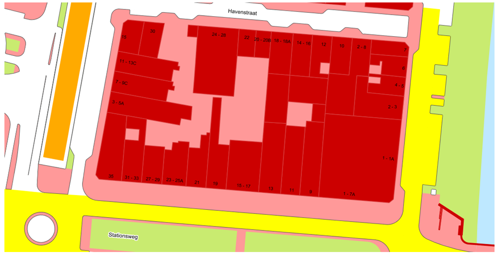

Teksten
=======

Visualisatie is geen onderdeel van het BGT-informatiemodel, maar een apart
aspect. Deze gegevenscatalogus bevat de objectdefinities. De visualisatie van
deze objecten wordt beschreven in het document Visualisatieregels BGT en IMGeo.
In deze gegevenscatalogus worden dan ook geen uitspraken gedaan over hoe de
producten van de BGT er uit moeten zien.

Alleen over de visualisatie van teksten wordt in deze gegevenscatalogus iets
gezegd. Dit is nodig, omdat deze zaken al door de bronhouders in acht moeten
worden genomen, om uiteindelijk een kaartbeeld van de BGT landelijk op een
uniforme wijze te kunnen presenteren.

In de BGT worden teksten opgenomen voor visualisatie en oriëntatie. Waar deze
teksten zijn opgenomen, worden zij vergezeld van een geometriepunt en eventuele
rotatie, zie 5.3. Deze teksten betreffen namen van openbare ruimten en een
nummeraanduidingreeks bij panden.

Visualisatie van openbare ruimtenamen op de BGT achtergrondkaart

Namen
-----

In de visualisatie van de BGT worden namen gepresenteerd van alle openbare
ruimten, zoals gedefinieerd in de BAG. De namen zijn bedoeld ter oriëntatie. Een
naam van een openbare ruimte kan meerdere malen worden gepresenteerd. Dit heeft
te maken met het gebruik binnen het schaalbereik van 1:500 tot 1:5.000. Als een
openbare ruimte een lengte heeft van meer dan 300 meter, dan is het noodzakelijk
om de naam vaker af te beelden.

Strikt genomen is het niet bekend waar een openbare ruimte van de BAG is
gelegen, omdat de BAG bij de vorming van de BGT nog geen geometrie van openbare
ruimten kent. De BGT ziet deze geometrie als een verantwoordelijkheid van de BAG
en heeft deze niet in de gegevenscatalogus opgenomen. De BGT ziet de openbare
ruimte niet als ‘harde’ topografie maar als een virtuele ruimte, zoals ook
wijken en buurten dat zijn. Mede daarom is de vlakgeometrie van de openbare
ruimte niet in de BGT opgenomen. IMGeo bevat wel een optionele uitbreiding, die
voorziet in een vlakgeometrie van de openbare ruimte.

De visualisatie van een openbare ruimtenaam vindt plaats door de coördinaten van
het midden (centrum) van de tekst vast te leggen, evenals de rotatie, zie 5.3,
van de tekst ten opzichte van de normale tekstrichting. De normale tekstrichting
is van links naar rechts oftewel, in een kaartbeeld met de noordrichting aan de
bovenzijde, van west naar oost. Voor namen van wegen, waterlopen en spoorbanen
dient de rotatiehoek te worden vastgelegd, zodat de naam met de richting van de
weg, waterloop of spoorbaan mee kan worden gevisualiseerd. De naam wordt
geautomatiseerd uit de BAG overgenomen.

Nummeraanduidingen
------------------

In de visualisatie van de BGT worden nummeraanduidingen gepresenteerd, die horen
bij panden, zoals gedefinieerd in de BAG voor de verblijfsobjecten in die
panden. Dit is bedoeld ter oriëntatie.

*Visualisatie van nummeraanduidingen op de BGT hoofdthema kaart*

De nummeraanduidingen van verblijfsobjecten in een pand worden verzameld tot een
nummeraanduidingreeks. Als er slechts één huisnummer voorkomt, wordt alleen deze
getoond. Bij meerdere huisnummers worden het eerste en het laatste huisnummer
getoond, gescheiden door een koppelteken, bijvoorbeeld 33-39.

Als in een reeks ook huisletters voorkomen, dan worden deze ook afgebeeld,
bijvoorbeeld 33A-33Z of 33A-39A. Als in een reeks ook toevoegingen voorkomen dan
worden deze niet afgebeeld.

Als in een pand één en slechts één verblijfsobject voorkomt, dan wordt de
nummeraanduiding hiervan volledig weergegeven, dus zowel het huisnummer als de
eventueel aanwezige huisletter en/of toevoeging.

Een speciaal geval treedt op als een pand op de grens van twee of meer openbare
ruimten is gelegen en nummeraanduidingen daarbinnen bij meerdere openbare
ruimten horen. In dit geval worden er meerdere (reeksen van) nummeraanduidingen
afgebeeld overeenkomstig bovenstaande regels.

De visualisatie van een nummeraanduidingreeks vindt plaats door de coördinaten
van het midden (centrum) van de tekst vast te leggen, alsmede de rotatie, zie
5.3, van de tekst ten opzichte van de normale tekstrichting. De normale
tekstrichting is van links naar rechts oftewel, in een kaartbeeld met de
noordrichting aan de bovenzijde, van west naar oost. Het coördinatenpunt van de
nummeraanduidingreeks wordt circa 4 meter vanaf de voorgevel (‘straatzijde’)
binnen het pand geplaatst.

De nummeraanduidingreeks wordt geplaatst met een minimale rotatie ten opzichte
van de tekstrichting, zodanig dat de nummeraanduidingreeks evenwijdig aan of
haaks op de voorgevel staat.

Locaties van nummeraanduidingen van lig- en standplaatsen worden in de BGT niet
geregistreerd. Locaties van individuele verblijfsobjecten zijn geen onderdeel
van de BGT. Deze worden in de BAG vastgelegd.

Rotatie
-------

Voor de rotatiehoek van een label van een BGT\|IMGeo object gelden de volgende
eigenschappen en eisen: Eenheid : booggraad; één booggraad is een 360ste deel
van een cirkelomtrek Oriëntering : met de klok mee (positief) t.o.v. normale
tekstrichting (horizontaal = 0 graden; voor een kaart die noord georiënteerd
is.) Decimale precisie : 1 (= 1 cijfer achter de komma, ofwel 1/10 booggraad)
Bereik (min/max) : [-90, +90], waarbij [270,360] niet gelijk is aan [-90,0].
