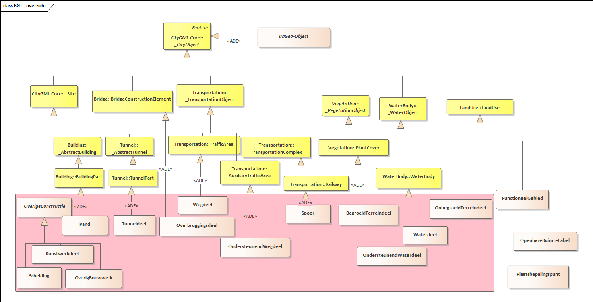

Semantisch gegevensmodel
========================

Onderstaande figuur is een vereenvoudigde weergave van de modellering van de
BGT-objecttypen (beige). Het IMGeo-object bevat een aantal algemene
eigenschappen, beschreven in hoofdstuk 7 en 8. Deze eigenschappen worden door
alle BGT objecttypen overerfd. Objecttypen met een gestippeld kader en
schuingedrukte tekst zijn abstracte objecttypen en komen niet als concreet
object voor in een BGT dataset.

Overzicht BGT-objecttypen
