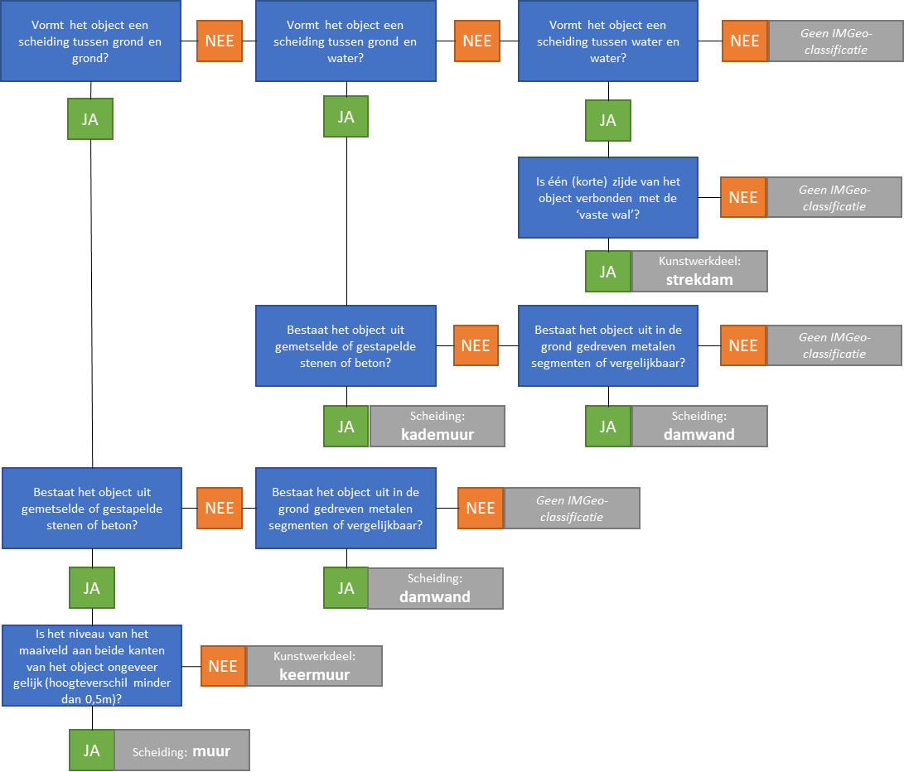

Scheiding
---------

### Indeling

De volgende scheidingen zijn BGT-inhoud: hekken, geluidsschermen, muren,
kademuren en walbeschermingen.

### Regels voor opname

Scheidingen worden als lijnobject vastgelegd als de breedte kleiner is dan 30cm.
Bij scheidingen breder dan 30cm moet de buitenomtrek waar het object de grond
raakt worden ingewonnen en vastgelegd als vlakgeometrie.

Een scheiding wordt vastgelegd waar het object de ondergrond raakt.

In de scheidingen worden onderbrekingen van \<1m genegeerd. Doorgangen worden
gezien als integraal onderdeel van de scheiding.

Scheidingen van het type hek die een minimale lengte van 10m en een minimale
hoogte van 1m hebben, worden vastgelegd.

Scheidingen van de typen kademuur en walbescherming worden opgenomen aan de
bovenzijde aan de waterkant. Kademuren breder dan 30cm worden ingewonnen als
vlakobject; de omtrek van het object aan de bovenzijde wordt dan vastgelegd.

Scheidingen van het type muur, met een minimale lengte van 1m en met een
minimale breedte van 30cm worden opgenomen. Een muur smaller dan 30cm wordt als
lijnobject vastgelegd, een bredere muur als vlakobject. Muren met een minimale
hoogte van 50cm worden vastgelegd.

In terreinen met een fysiek voorkomen ‘erf’ worden alleen die scheidingen
opgenomen die direct aan de straatzijde zijn gelegen.

Ter ondersteuning bij het vaststellen welk objecttype het betreft, geldt
onderstaande beslisboom voor muren en wanden.

*Beslisboom afbakening van muren, wanden en dammen.*
