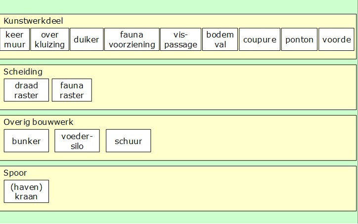

Inleiding
=========

Het Informatiemodel Geografie (IMGeo) beschrijft hoe objectgerichte geografische
informatie moet worden vastgelegd, zodat landelijk uitwisseling van deze
informatie mogelijk is. In 2007 is versie 1.0 van IMGeo vastgesteld. Het
informatiemodel voor de Basisregistratie Grootschalige Topografie (BGT) is
vervolgens in samenhang met IMGeo ontwikkeld.

In februari 2012 is versie 2.0 van IMGeo vastgesteld, waarin het informatiemodel
BGT in zijn geheel is opgenomen. IMGeo bestaat sindsdien uit een verplicht deel,
te weten de BGT, en een optio­neel deel, te weten de plus- en beheertopografie.

Vanaf versie 2.0 is IMGeo gebaseerd op CityGML, een internationale standaard
voor 3D geo-informatie. De IMGeo objecttypen zijn gekoppeld aan klassen uit het
CityGML informatiemodel en hebben hiermee de mogelijkheid om 3D geometrie in
verschillende gradaties van detail op te nemen.

IMGeo is beschreven in een gegevenscatalogus, die uit twee delen bestaat.
Deel I beschrijft het verplichte deel van IMGeo: de Gegevenscatalogus BGT.
Deel II, het deel dat u nu leest, beschrijft het optionele deel: de
Gegevenscatalogus IMGeo.

Vanaf 2013 is op basis van BGT versie 1.1.1 en IMGeo 2.1.1 de opbouw van de BGT
door bronhouders gestart. Eind 2020 is de laatste fase van de transitie
afgerond. Tijdens de opbouw van de BGT is veel ervaring opgedaan met de
toepassing van de regels van IMGeo.

Hieruit kwam naar voren dat de BGT niet geheel uniform is opgebouwd door
bronhouders door ruimte voor interpretatie in de afbakeningsregels, en dat IMGeo
niet volledig ruimte biedt om alle objecten op te nemen waar behoefte aan is
vanuit o.m. beheer openbare ruimte, netbeheerders en hulpdiensten.

Deze versie is een optimalisatie van het model door:

1.  het verduidelijken en aanscherpen van de afbakeningsregels, zodat de BGT
    uniformer voor afnemers, en makkelijker maakbaar voor bronhouders wordt.

2.  het uitbreiden met ontbrekende gegevens, zodat sectoren beter kunnen
    aansluiten op IMGeo.

Ten grondslag aan deze versie van de IMGeo catalogus ligt het wijzigingsvoorstel
IMGeo 2.2 versie 8 juni 2020, waarin alle wijzigingen voor de verbetering en
uitbreiding van IMGeo zijn beschreven.

IMGeo, het optionele deel
-------------------------

Het informatiemodel IMGeo is een uitbreiding in diepte en breedte op de
verplichte Basisregistratie Grootschalige Topografie (BGT). Een wegdeel is in de
BGT bijvoorbeeld omschreven als Wegdeel: rijbaan, gesloten verharding. Met IMGeo
kan deze beschrijving verder wordt gespecificeerd naar Wegdeel: rijbaan,
gesloten verharding, asfaltbeton. Deze uitgebreide objectbeschrijving is
vervolgens met verschillende applicaties uit te wisselen.

Het verplichte informatiemodel van de BGT vormt een integraal onderdeel van
IMGeo.

Doel
----

De verdieping- en verbredingslag op de BGT, die in IMGeo is vastgelegd als
optioneel deel, is bedoeld voor het opslaan en uitwisselen van plus- en
beheertopografie. Waarschijnlijk is er geen behoefte om deze plustopografie voor
heel Nederland gebiedsdekkend beschikbaar te hebben. Wel zijn er bronhouders en
afnemers die deze informatie willen uitwisselen. Een informatiemodel voor de
plus- en beheertopografie is ook voor softwareleveranciers van belang. Zij
kunnen hun softwareproducten hierop inrichten. IMGeo zorgt ervoor dat wie de
optionele informatie wil beheren en/of uitwisselen, dit volgens
een landelijke standaard kan doen (zie ook paragraaf 2.1.1 en 2.1.2).

IMGeo biedt ook voor de uitwisseling van grootschalige topografie in 3D de
landelijke standaard en baseert zich hiervoor op de internationale standaard
CityGML.

Inwinning en gebruik
--------------------

Het gebruik van het optionele deel van IMGeo is niet verplicht. Bronhouders zijn
dus niet verplicht IMGeo-objecten in te winnen – al zullen zij dit voor hun
eigen beheer vaak wel doen. Evenmin is het gebruik van de optionele
IMGeo-objecten verplicht, in tegenstelling tot het gebruik van de BGT-objecten.

Een bronhouder levert geen IMGeo objecten die liggen op BGT objecten van een
andere bronhouder.

Inhoud
------

IMGeo bevat naast de verplichte BGT-set ook optionele objecttypen. Dit zijn niet
alleen fysieke, topografische objecten, zoals inrichtingselementen, maar ook
functionele en registratieve gebieden en nadere indelingen van wegen, water en
terreinen voor beheer.

Onderstaande figuur geeft een overzicht van de optionele objecttypen in de BGT.

*Inhoud van IMGeo: optionele objecttypen*

De meeste van deze objecttypen hebben een attribuut ‘type’ waarmee het object
nader geclassificeerd kan worden. Zo kan een Bord worden opgenomen met de nadere
classificatie ‘informatiebord’. Ook dit is optioneel; het attribuut mag worden
weggelaten. Zo kan men ervoor kiezen alle borden op te nemen, maar niet nader te
classificeren om wat voor soort bord het gaat.

Naast extra, optionele objecttypen bevat IMGeo voor de meeste BGT-objecttypen
een nadere verdieping van de classificatie en/of een uitbreiding van de
populatie van het objecttype. Zowel de verdieping van BGT-classificaties als de
uitbreiding van de populatie komen tot uitdrukking in de uitbreiding die IMGeo
kent van de BGT-domeinwaardenlijsten.

*Voorbeeld van nadere classificatie in IMGeo*

| BGT                 | IMGeo optionele deel |
|---------------------|----------------------|
| gesloten verharding | asfalt               |
|                     | cementbeton          |
| open verharding     | betonstraatstenen    |
|                     | gebakken klinkers    |
|                     | tegels               |
|                     | sierbestrating       |
|                     | beton element        |
| half verhard        | grasklinkers         |
|                     | schelpen             |
|                     | puin                 |
|                     | grind                |
|                     | gravel               |
| onverhard           | boomschors           |
|                     | zand                 |

*Uitbreidingen van de populatie van BGT-objecttypen*

Voorbeelden ter verduidelijking:

-   Waar de BGT voor begroeid terreindeel het fysiek voorkomen
    ‘groenvoorziening’ kent, is dit in IMGeo nader geclassificeerd tot onder
    meer bosplantsoen, gras en beplanting.

-   De populatie van kunstwerkdeel is uitgebreid met onder meer keermuur,
    overkluizing, duiker en faunavoorziening. Kunstwerken van dit soort worden
    in de BGT niet opgenomen, wel in IMGeo.

De inhoud van IMGeo wordt gevormd door:

-   Abstracties van fysieke topografische objecten;

-   Virtuele objecten die een geometrie hebben en van belang zijn voor het tonen
    op een grootschalige kaart en/of bij het beheer van de openbare ruimte;

Hierbij is er sprake van:

-   dat de objecten voorkomen bij meerdere partijen die grootschalige topografie
    bijhouden;

-   meervoudig gebruik. Deze regel is, omdat de objecten optioneel zijn, niet zo
    streng gehanteerd als in de BGT (‘**duidelijk** meervoudig gebruik’);

-   dat gegevens die nodig zijn voor het eigen beheer (bijvoorbeeld een
    attribuut ‘maaifrequentie’ bij een grasveld) niet zijn opgenomen.
