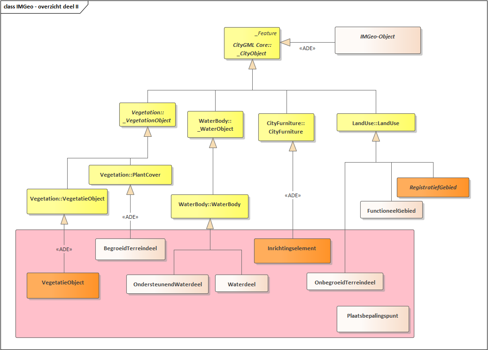
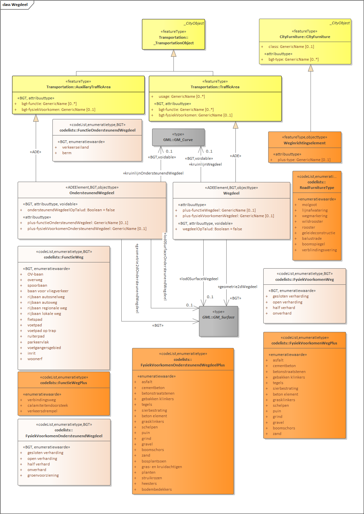
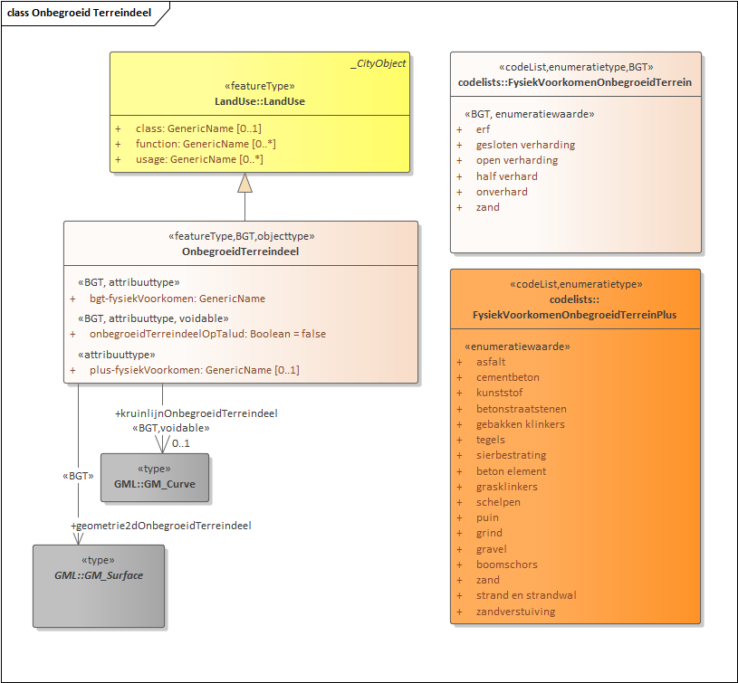
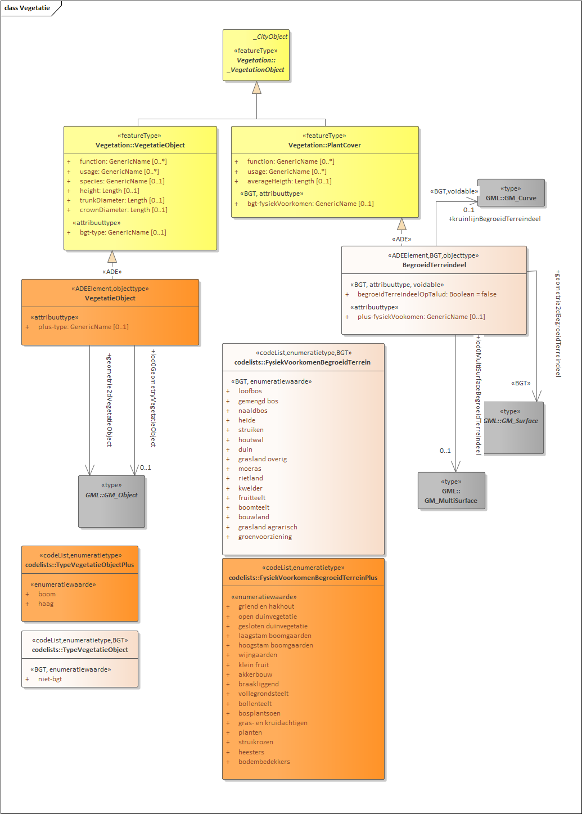
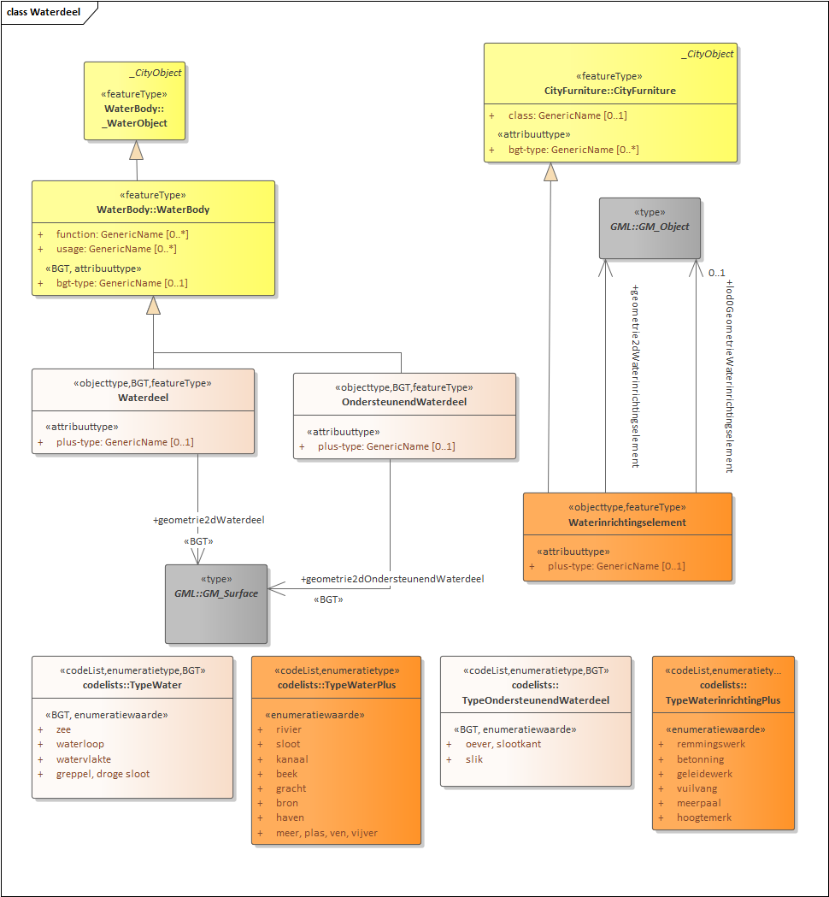
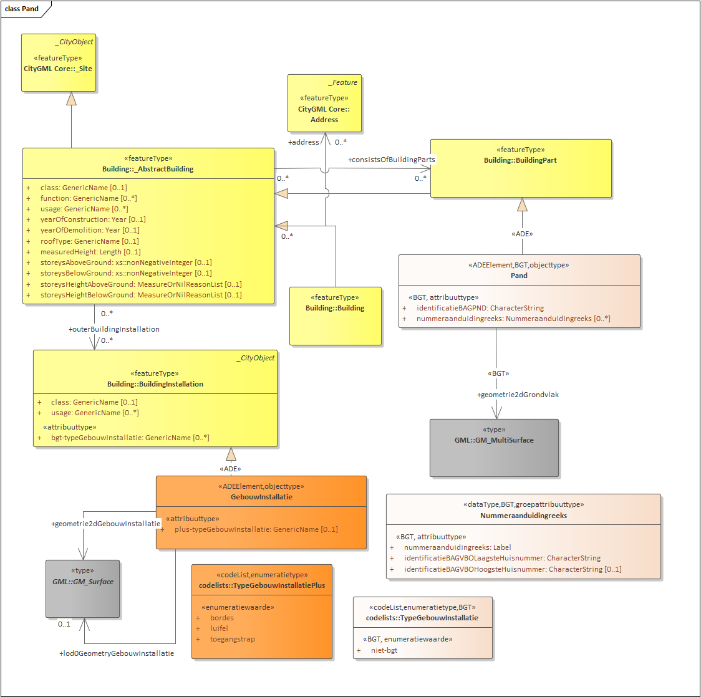
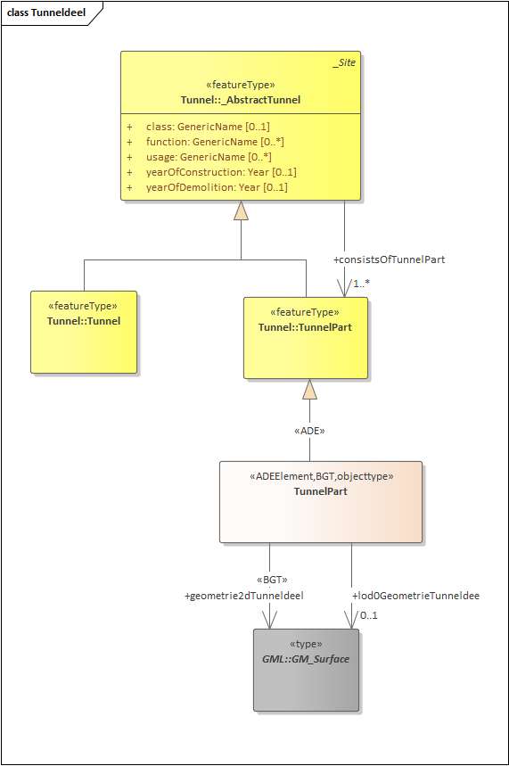
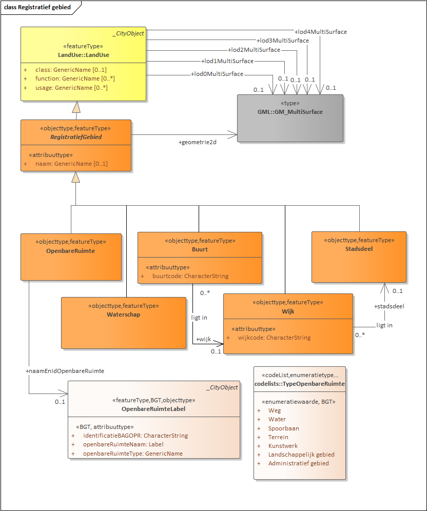

Semantisch gegevensmodel
========================

Het IMGeo gegevensmodel is te uitgebreid om in één plaat te laten zien.
Hieronder wordt het overzicht getoond in twee delen waarop de objecttypen, die
tot de BGT behoren, in lichtroze zijn afgebeeld en de objecttypen, die tot het
optionele IMGeo deel behoren, in oranje.

In het model is te zien dat de IMGeo klassen zijn afgeleid van klassen van
CityGML. De klasse IMGeo-Object is gedefinieerd als een «ADEElement»
specialisatie die extra eigenschappen toevoegt aan \_CityObject uit CityGML. Via
die klasse erven alle IMGEO objecttypen deze eigenschappen.

*IMGeo model overzicht deel I: constructies en transport*

*IMGeo model overzicht deel II: terrein, water, inrichtingselementen en
gebieden*

In de rest van dit hoofdstuk wordt de detailmodellering getoond in meerdere
figuren. In deze diagrammen zijn de IMGeo klassen uitgewerkt als specialisaties
van klassen uit CityGML. Deze OGC-standaard bevat een uitgebreid semantisch
model voor 3D topografie. IMGeo is van CityGML afgeleid om zo het
informatiemodel 3D klaar te maken. Zoals beschreven in paragraaf 2.6.2 zijn de
IMGeo klassen gemodelleerd als subklasse van CityGML van de vorm «ADEElement» of
«featureType». De laatsten zijn volwaardige subklassen, de eersten komen
conceptueel volledig overeen met de CityGML superklasse en voegen er alleen
eigenschappen aan toe.

In de diagrammen is gebruik gemaakt van kleur om te laten zien welke klassen bij
CityGML, BGT of het optionele IMGeo deel horen:

-   CityGML: geel

-   BGT: beige

-   IMGeo optioneel: oranje

In het informatiemodel zijn BGT en IMGeo samen gemodelleerd. Niet alleen op
klasseniveau, maar ook op attribuut-, associatie- en domeinwaardenlijstenniveau
is het onderscheid tussen BGT en IMGeo gemaakt. Een BGT klasse kan een attribuut
of associatie hebben die bij het optionele IMGeo deel hoort en voor de BGT niet
geleverd hoeft te worden. Een domeinwaardenlijst (enumeratie) kan onderdeel van
BGT of IMGeo zijn, waarbij een IMGeo waardenlijst waarden bevat die die
optioneel zijn en ofwel een optionele nadere detaillering bieden, ofwel objecten
aanduiden die voor de BGT niet geleverd hoeven te worden maar in IMGeo wel
toegestaan zijn.

Alle objecten, attributen, associaties en domeinwaardenlijsten die onderdeel
zijn van de BGT zijn aangemerkt met een «BGT» stereotype. Alle objecten,
attributen, associaties en domeinwaardenlijsten die deze markering niet hebben,
horen bij het optionele deel van IMGeo.

De rest van dit hoofdstuk bevat figuren van alle IMGeo UML diagrammen.

*Wegdeel, ondersteunend wegdeel en weginrichtingselement*

*Onbegroeid terreindeel*

*Begroeid terreindeel en vegetatieobject*

*Waterdeel en waterinrichtingselement*

*Pand en gebouwinstallatie*

*Spoor*

*Abstracte superklasse OverigeConstructie met subklassen: kunstwerkdeel, overig
bouwwerk, scheiding en overige scheiding*

*Overbruggingsdeel*

*Tunneldeel*

*Inrichtingselementen*

*Registratief gebied*

*Functioneel gebied*
