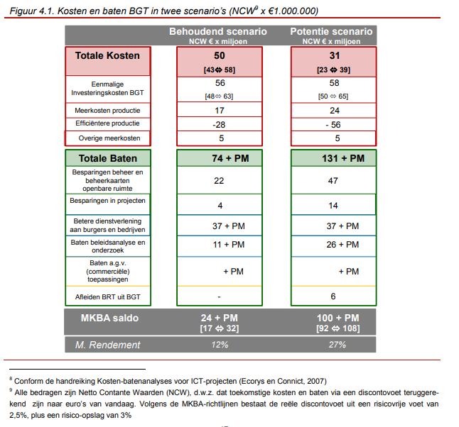

Bijlage 1 Toelichting baten BGT vs. IMGeo 2.2
=============================================

Baten van uniformiteit
----------------------

\- Door het uniforme informatiemodel zal standaardisatie van bestekken
plaatsvinden en kan goedkoper worden uitbesteed.

\- Het feit dat de kaart landsdekkend uniform is, vergroot de mogelijkheden voor
landelijke analyses verder. Dit geldt ook voor (wetenschappelijk) onderzoek,
zeker als de BGT tegen minimale verstrekkingskosten beschikbaar is.

\- De uniformiteit van de BGT en de kwaliteitsverbetering die daarmee samenhangt
kan een aanleiding zijn om meer samen te werken: in het Samenwerkingsverband
Bronhouders (SVB) of bijvoorbeeld in regionale verbanden rond een grote
gemeente. Hiermee zijn schaalvergrotingsvoordelen te behalen. Ook zijn er bij de
gemeenten die zelf topografie produceren, schaalvoordelen te behalen door meer
samenwerking bij de inwinning van topografie.

\- De belangrijkste baat van de BGT is het eenmalig inwinnen, meervoudig
gebruik. Voorkomen wordt dat dezelfde objecten door verschillende partijen
worden ingewonnen. De baten hiervan zijn groot, zeker wanneer het enkelvoudig
inwinnen ook geldt voor de topografie die nodig is voor aanlegprojecten, de
productie van de kleinschalige topografie (BRT) en de beheertopografie.

Baten van uitbreiden van gegevens:
----------------------------------

**- Betere informatievoorziening voor netbeheerders en veiligheidsdiensten**.

Bij een calamiteit is het belangrijk te weten wat er zich in de omgeving
bevindt. (best practice Brandweer:
https://www.brandweer.nl/media/1679/boek_inowit_deel_1.pdf)

Het is niet wenselijk als de uitrukkende eenheid tijd verliest door een
onbekende wegopbreking of moet zoeken naar de waterwinning of de toegang tot een
object.

De brandweer heeft informatie nodig om veilig en efficiënt te kunnen werken.
Informatie is alleen bruikbaar als deze actueel, eenduidig en tijdig beschikbaar
is.

**MKBA BGT:**

De BGT zal er - in combinatie met de digitalisering van veel andere informatie -
voor zorgen dat de brandweer en hulpdiensten de situatie op de plek van een
incident of ramp beter en sneller kunnen inschatten. Dit betekent de volgende
baten: . minder overmaat aan mensen en materieel ter plaatse. Dit is een
potentieel grote efficiencybaat; . men is sneller ter plaatse en kan sneller
handelen: dit voorkomt schade en slachtoffers.

Vaak is voordat een incident optreedt niet duidelijk welke bronnen benodigd
zijn. De BGT heeft verschillende toepassingsmogelijkheden: - In de meldkamer om
de plaats van een incident accuraat in beeld te krijgen en te beschikken over
een gedetailleerde betrouwbare kaart met o.a. terreinen en water. De plaats van
het incident kan accurater worden aangeduid. Daarnaast is t.b.v. het
netcentrisch werken een plot met een gedetailleerde omgeving en ingezette
middelen van groot belang. - De BGT is een logische ondergrond voor
bereikbaarheidskaarten en aanvalsplannen. Door de BGT kan extra informatie
t.a.v. de ligging van bluswatervoorzieningen in het terrein en t.o.v. openbaar
water in beeld worden gebracht. - Preparatief/risicobeheersing bij bijvoorbeeld
vergunningverlening. Met een betrouwbare BGT is de omgeving sneller in beeld en
kan vergunningverlening sneller en efficiënter plaatsvinden.

### Betere aansluiting beheertopografie op IMGeo.

Met name gemeenten die overstappen op een integrale beheerkaart kunnen
aanzienlijke kostenreducties realiseren.

Voor veel van de baten geldt dat de BGT op zichzelf staand niet tot de genoemde
effecten leidt, maar dat het meenemen van de plus- en beheertopografie volgens
IMGeo 2.0 een aanvullende voorwaarde is. Vooral de gemeenten die nog niet over
zijn op integrale beheerkaarten hebben veel te winnen.

Er is een dubbele registratie van allerlei andere informatiebronnen (bij
beheerpakketten en GBKN), zowel binnen organisaties als tussen verschillende
organisaties. Dit leidt tot kosten voor meervoudig inwinnen van dezelfde
gegevens, dubbele bijhouding en dubbele afstemming.

Het is de bedoeling dat er één structuur komt waarin de BGT-objecten de basis
vormen, met als nadere uitwerking daarvan de plustopografie en als nog diepere
uitwerking de beheertopografie. Volgens deze structuur kunnen al deze objecten
via IMGeo 2.0 uitgewisseld worden.

De BGT is voor veel bronhouders een aanleiding om versneld over te stappen naar
een nieuwe werkwijze in het beheer openbare ruimte. Grootschalige topografie
wordt van oorsprong veel ingezet voor dit doel. De basiskaart is daarbij een
referentie voor beheerkaarten met specifieke beheerinformatie. De beheerkaarten
worden van oorsprong per sector (groen, riolering, wegen, water) apart
geproduceerd. Dit vertaalt zich in veel dubbele inwinningskosten. Als
beheerafdelingen (binnen 1 bronhouder) gezamenlijk gegevens in gaan winnen en
overstappen op een integrale beheerkaart zijn daarom baten te behalen: een
besparing op fte‟s bij de productie van de beheerkaarten. Daarnaast kan een
besparing op het beheer zelf worden gerealiseerd. De objectgerichte kaart kan
worden benut voor betere planningen ten aanzien van het beheer van groen, riool,
wegen, vaarwegen en/of terreinen. Een beter inzicht gaat ook samen met minder
risico (hoe oud is de riolering op de plek waar gewerkt wordt, wat is het risico
op schade?). Daarmee wordt begroten makkelijker. Daarnaast wordt integraliteit
van beheer makkelijker te realiseren omdat de verschillende beheersystemen
eenvoudig op elkaar te plotten zijn. Werkzaamheden in dezelfde straat worden
gecombineerd uitgevoerd. Dat leidt tot lagere kosten, maar ook tot minder
overlast voor de omgeving. Randvoorwaarde om deze baten te realiseren is het
gelijktijdig inwinnen van de BGT en de beheertopografie (IMGeo 2.0) en de
overstap naar integrale beheerkaarten. De BGT is overigens geen noodzakelijke
voorwaarde om over te stappen op integraal beheer, een aantal bronhouders is
hier al toe overgegaan. Wel zullen bronhouders naar aanleiding van de BGT de
stap sneller zetten.
