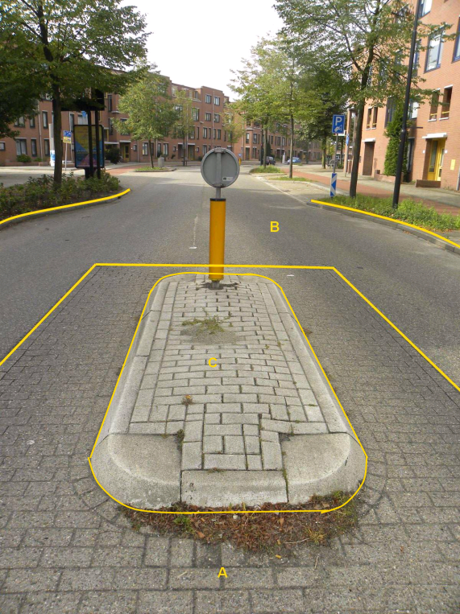

Objecttype: OndersteunendWegdeel
--------------------------------

### OndersteunendWegdeel, functie: verkeerseiland

C:

| *OndersteunendWegdeel*   | *Attribuutwaarde* | *Opmerkingen* |
|--------------------------|-------------------|---------------|
| typeOndersteunendWegdeel | Verkeerseiland    |               |
| fysiekVoorkomen          | Open verharding   |               |
| relatieveHoogteligging   | 0                 |               |

A: Wegdeel, Rijbaan: Lokale weg, Open verharding.

B: Wegdeel, Rijbaan: Lokale weg, Gesloten verharding.

### OndersteunendWegdeel, functie: berm, fysiek voorkomen: open verharding

Het ondersteunend wegdeel Berm kent dezelfde waarden voor fysiek voorkomen als
geldt voor Wegdeel, aangevuld met de classificatie groenvoorziening zoals
voorkomt bij Begroeid terreindeel.

Niet van al deze mogelijke classificaties zijn fotovoorbeelden opgenomen.

B:

| **OndersteunendWegdeel** | **Attribuutwaarde** | **Opmerkingen** |
|--------------------------|---------------------|-----------------|
| functie                  | berm                |                 |
| Fysiek voorkomen         | open verharding     |                 |
| relatieveHoogteligging   |  0                  |                 |

A: Wegdeel, Rijbaan: Lokale weg, Gesloten verharding.

C: Wegdeel, Fietspad, Wegdeel, Gesloten verharding.

D: Wegdeel, Voetpad, Open verharding.

### OndersteunendWegdeel, functie: berm, fysiek voorkomen onverhard

### OndersteunendWegdeel, functie: berm, fysiek voorkomen groenvoorziening

B:

| *OndersteunendWegdeel*   | *Attribuutwaarde* | *Opmerkingen* |
|--------------------------|-------------------|---------------|
| typeOndersteunendWegdeel | Berm              |               |
| fysiekVoorkomen          | onverhard         |               |
| relatieveHoogteligging   | 0                 |               |

C:

| *OndersteunendWegdeel*   | *Attribuutwaarde* | *Opmerkingen* |
|--------------------------|-------------------|---------------|
| typeOndersteunendWegdeel | Berm              |               |
| fysiekVoorkomen          | groenvoorziening  |               |
| relatieveHoogteligging   | 0                 |               |

A: Wegdeel, Rijbaan: Lokale weg, Gesloten verharding.
