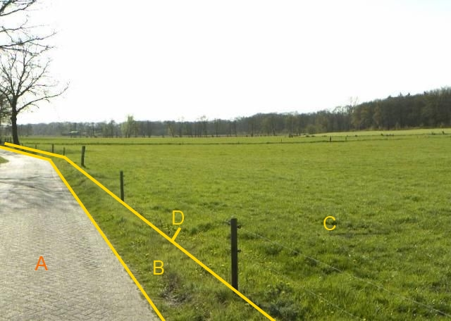

### BegroeidTerreindeel, fysiekVoorkomen: grasland agrarisch

C:

|                         |                     |                 |
|-------------------------|---------------------|-----------------|
| **BegroeidTerreindeel** | **Attribuutwaarde** | **Opmerkingen** |
| fysiekVoorkomen         | Grasland agrarisch  |                 |
| relatieveHoogteligging  |  0                  |                 |

A: wegdeel, rijbaan:lokale weg, open verharding.

B: ondersteunend wegdeel: berm, fysiek voorkomen: groenvoorziening.

D: IMGeo inhoud: scheiding, draadraster.
