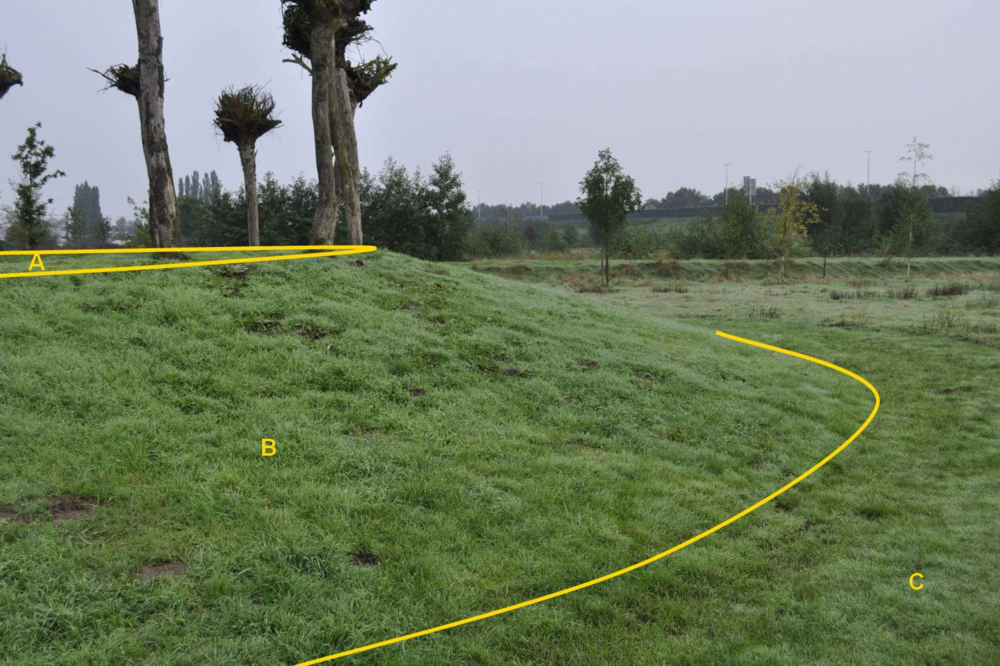

Grasland met een talud met kruinlijngeometrie

B:

| ***BegroeidTerreindeel*** | ***Attribuutwaarde*** | ***Opmerkingen*** |
|---------------------------|-----------------------|-------------------|
| fysiekVoorkomen           | Grasland overig       |                   |
| Talud                     | ja                    |                   |
| Kruinlijngeometrie        | ja                    |                   |
| relatieveHoogteligging    |                       |                   |
