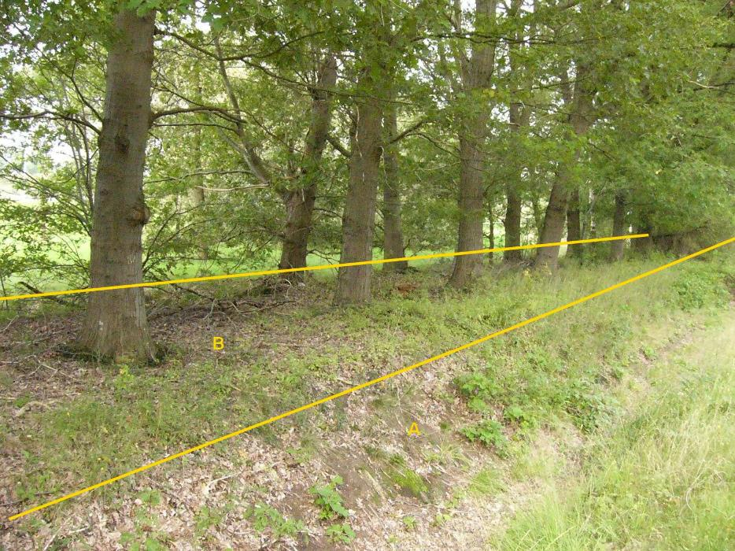

### BegroeidTerreindeel, fysiekVoorkomen: houtwal

B:

| ***BegroeidTerreindeel*** | ***Attribuutwaarde*** | ***Opmerkingen*** |
|---------------------------|-----------------------|-------------------|
| fysiekVoorkomen           | houtwal               |                   |
| relatieveHoogteligging    | 0                     |                   |

A: waterdeel, greppel/droge sloot.
