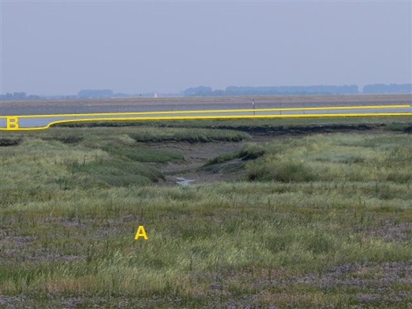

### BegroeidTerreindeel, fysiekVoorkomen: kwelder

A:

|                           |                     |                 |
|---------------------------|---------------------|-----------------|
| **OnbegroeidTerreindeel** | **Attribuutwaarde** | **Opmerkingen** |
| fysiekVoorkomen           | kwelder             |                 |
| relatieveHoogteligging    |  0                  |                 |

B: waterloop.
