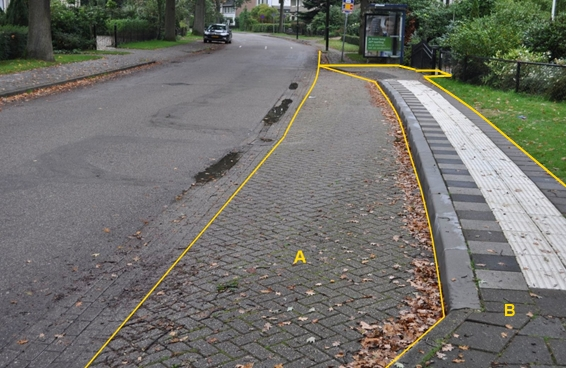

Het gebied binnen de gele lijnen, bestaande uit de fysieke objecten wegdelen A en B en een abri, kan als functioneel gebied type bushalte worden geclassificeerd.

Een kaartje wordt nog toegevoegd waarop dit functioneel gebied is afgebeeld op de topografie.

|                        |                     |                 |
|------------------------|---------------------|-----------------|
| **Functioneel gebied** | **Attribuutwaarde** | **Opmerkingen** |
| Type                   | bushalte            |                 |
