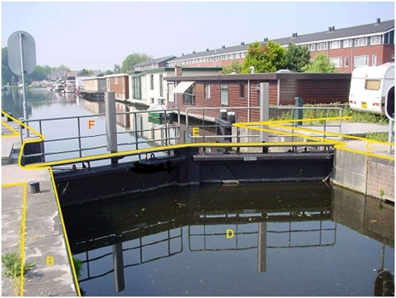

### Kunstwerkdeel, type: sluis

De waterloop wordt door de sluis E opgeknipt in twee waterdelen D en F.

Overige objecten behoren als afzonderlijke typen tot BGT-inhoud, zoals o.a. de kademuren als type scheiding.

E:

|                         |                     |                 |
|-------------------------|---------------------|-----------------|
| **overigKunstwerkdeel** | **Attribuutwaarde** | **Opmerkingen** |
| type                    | sluis               |                 |
| relatieveHoogteligging  |  0                  |                 |
