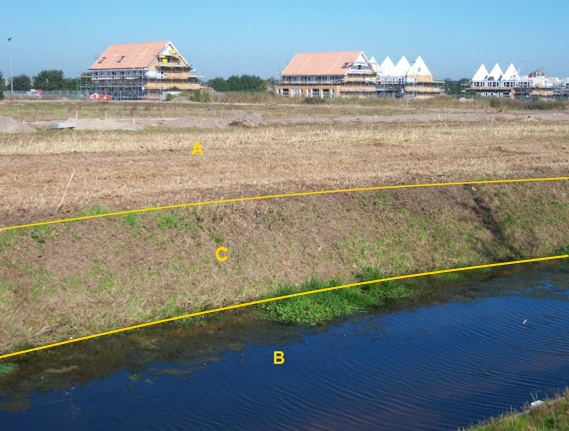

### OnbegroeidTerreindeel, fysiekVoorkomen: onverhard

A:

|                           |                     |                 |
|---------------------------|---------------------|-----------------|
| **OnbegroeidTerreindeel** | **Attribuutwaarde** | **Opmerkingen** |
| fysiekVoorkomen           | onverhard           |                 |
| relatieveHoogteligging    |  0                  |                 |

B: waterdeel, waterloop.

C: ondersteunend waterdeel, oever/slootkant.
