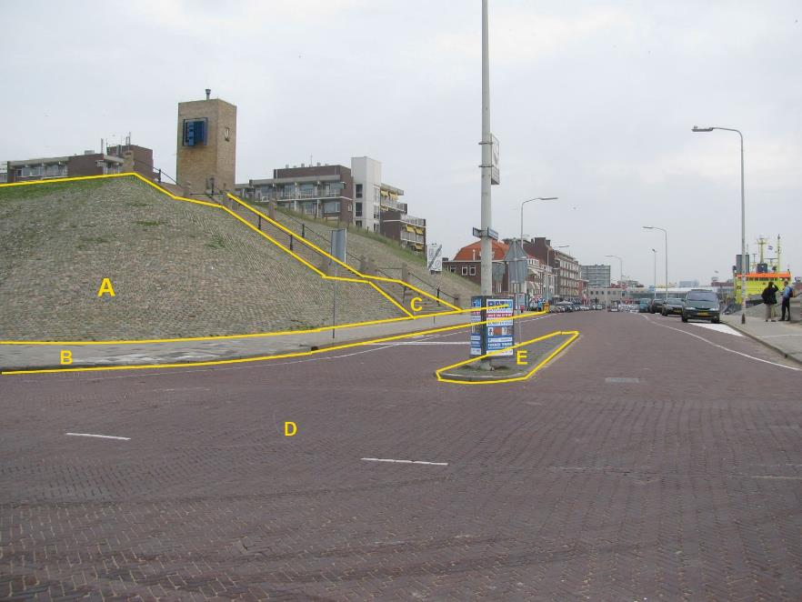

### OnbegroeidTerreindeel, fysiekVoorkomen: open verharding

A:

|                           |                     |                 |
|---------------------------|---------------------|-----------------|
| **OnbegroeidTerreindeel** | **Attribuutwaarde** | **Opmerkingen** |
| fysiekVoorkomen           | open verharding     |                 |
| Talud                     | ja                  |                 |
| kruinlijngeometrie        |  ja                 |                 |
| relatieveHoogteligging    |  0                  |                 |

B: Wegdeel, Voetpad, Open verharding.

C: Wegdeel, Voetpad op trap, Gesloten verharding.

D: Wegdeel, Rijbaan: Lokale weg, Open verharding.

E: Ondersteunend wegdeel± Verkeerseiland, fysiek voorkomen: open verharding.
