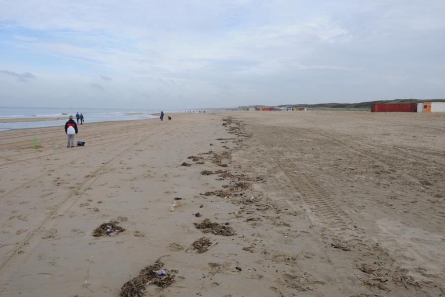

### OnbegroeidTerreindeel, FysiekVoorkomen: zand

|                           |                     |                 |
|---------------------------|---------------------|-----------------|
| **OnbegroeidTerreindeel** | **Attribuutwaarde** | **Opmerkingen** |
| fysiekVoorkomen           | zand                |                 |
| relatieveHoogteligging    |  0                  |                 |

Dit terreindeel is aan de zeezijde begrensd door de UNCLOS-lijn en aan de andere zijde door de teenlijn van het begroeide terreindeel Duin.
