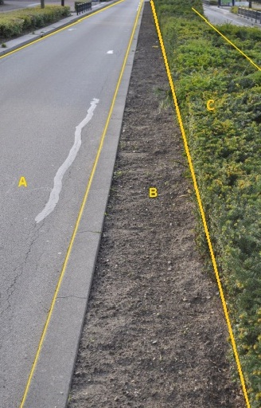

### OndersteunendWegdeel, functie: berm, fysiek voorkomen groenvoorziening

B:

| ***OndersteunendWegdeel*** | ***Attribuutwaarde*** | ***Opmerkingen*** |
|----------------------------|-----------------------|-------------------|
| typeOndersteunendWegdeel   | Berm                  |                   |
| fysiekVoorkomen            | onverhard             |                   |
| relatieveHoogteligging     | 0                     |                   |

C:

| ***OndersteunendWegdeel*** | ***Attribuutwaarde*** | ***Opmerkingen*** |
|----------------------------|-----------------------|-------------------|
| typeOndersteunendWegdeel   | Berm                  |                   |
| fysiekVoorkomen            | groenvoorziening      |                   |
| relatieveHoogteligging     | 0                     |                   |

A: Wegdeel, Rijbaan: Lokale weg, Gesloten verharding.

## Objecttype Spoor
