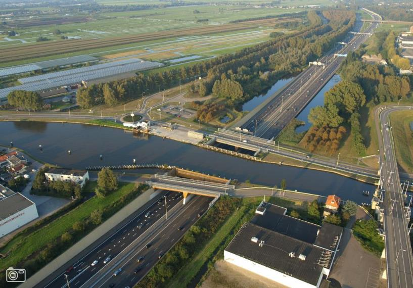

|                        |                     |                 |
|------------------------|---------------------|-----------------|
| **Overbruggingsdeel**  | **Attribuutwaarde** | **Opmerkingen** |
| Type overbrugging      | aquaduct            |                 |
| relatieveHoogteligging |  0                  |                 |

De wegdelen en evt. andere objecten die onder (de projectie van) het aquaduct zijn gelegen hebben een relatieve hoogteligging van: -1.
