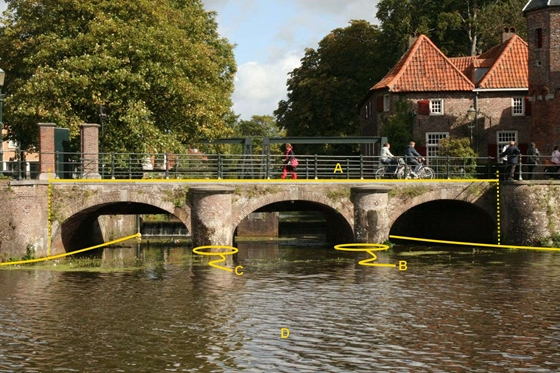

A:

|                        |                     |                 |
|------------------------|---------------------|-----------------|
| **Overbruggingsdeel**  | **Attribuutwaarde** | **Opmerkingen** |
| Type overbrugging      | brug                |                 |
| Type overbruggingsdeel | dek                 |                 |
| Beweegbaar             | nee                 |                 |
| relatieveHoogteligging |  1                  |                 |

B en C:

|                        |                     |                 |
|------------------------|---------------------|-----------------|
| **Overbruggingsdeel**  | **Attribuutwaarde** | **Opmerkingen** |
| Type overbrugging      | brug                |                 |
| Type overbruggingsdeel | pijler              |                 |
| Beweegbaar             | nee                 |                 |
| relatieveHoogteligging |  0                  |                 |
