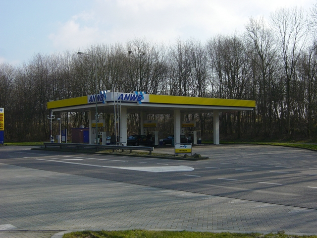

### OverigBouwwerk, type: overkapping

Uitsluitend de maaiveldgeometrie van de pilaren vormt als multivlak de BGT-inhoud van de overkapping, eventueel vormt de dakrand van het afdak inhoud voor IMGeo op niveau +1.

|                        |                     |                 |
|------------------------|---------------------|-----------------|
| **OverigBouwwerk**     | **Attribuutwaarde** | **Opmerkingen** |
| type                   | overkapping         |                 |
| relatieveHoogteligging |  0                  |                 |
