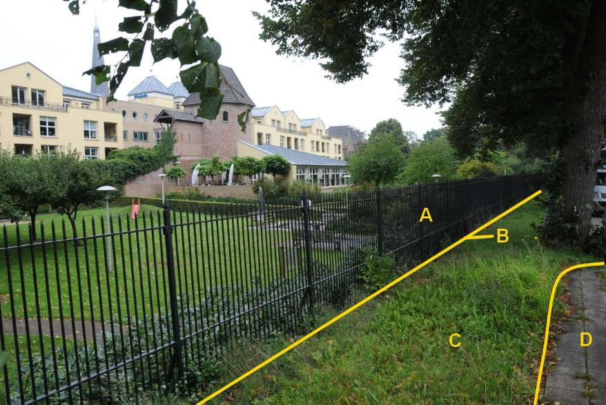

### Scheiding, type: hek

B:

|                        |                     |                 |
|------------------------|---------------------|-----------------|
| **Scheiding**          | **Attribuutwaarde** | **Opmerkingen** |
| type                   | hek                 |                 |
| relatieveHoogteligging |  0                  |                 |

A: onbegroeid terreindeel, erf.

C: ondersteunend wegdeel, berm, fysiek voorkomen: groenvoorziening.

D: wegdeel, voetpad, open verharding.

## Objecttype: Functioneel gebied
