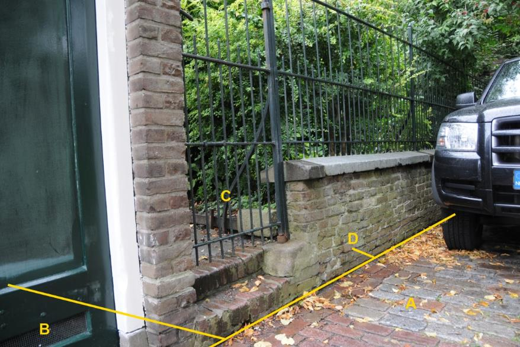

### Scheiding, type: muur

D:

|                        |                     |                                                                                    |
|------------------------|---------------------|------------------------------------------------------------------------------------|
| **Scheiding**          | **Attribuutwaarde** | **Opmerkingen**                                                                    |
| type                   | muur                | Muur met hek is &gt; 1m hoog; de voet van de muur aan de straatzijde is BGT-inhoud |
| relatieveHoogteligging |  0                  |                                                                                    |

A: wegdeel, rijbaan: lokale weg, open verharding.

B: pand

C: onbegroeid terreindeel, erf.

C en D zijn BGT-inhoud want de hoogte van de muur &gt; 0,5 m. Het zijn afzonderlijke objecten omdat de onderbreking bij A &gt; 1 m.

C en D:

| ***Scheiding***        | ***Attribuutwaarde*** | ***Opmerkingen***             |
|------------------------|-----------------------|-------------------------------|
| typeScheiding          | Muur                  | Lijn, want breedte &lt; 0.3 m |
| relatieveHoogteligging |  0                    |                               |

A: onbegroeid terreindeel, open verharding.

B: wegdeel, voetpad, open verharding.
