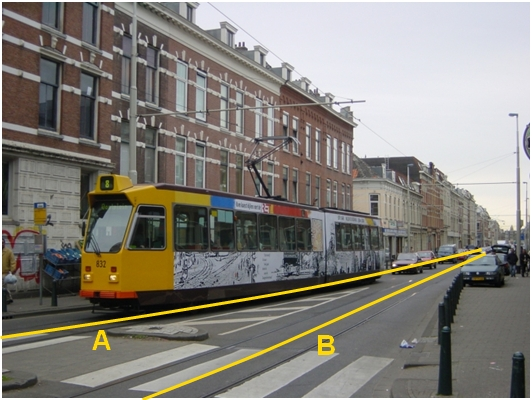

### Spoor, type: tram

A en B (gescheiden objecten):

|                        |                     |                 |
|------------------------|---------------------|-----------------|
| **Spoor**              | **Attribuutwaarde** | **Opmerkingen** |
| functie                | Tram                |                 |
| relatieveHoogteligging |  0                  |                 |

## Objecttype: OnbegroeidTerreindeel
