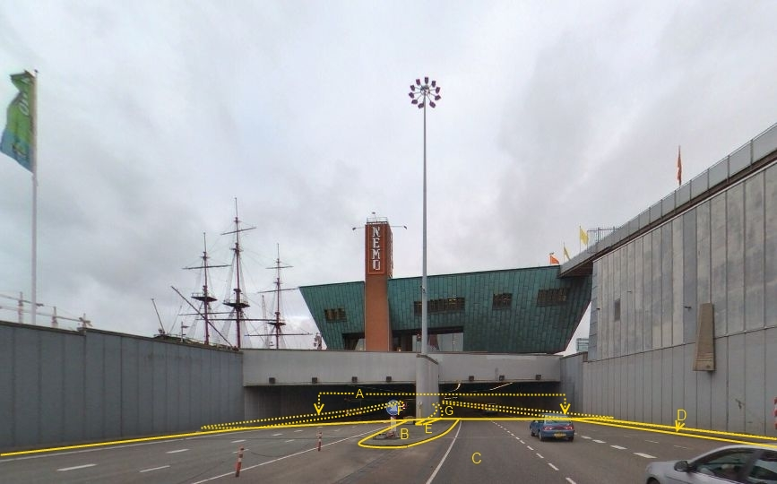

### Type: tunneldeel

Op de foto is het tunneldeel A enerzijds begrensd door de overgang met het boven-grondse wegdeel C ter hoogte van het dichte tunneldak en anderzijds door de buitenste zijbegrenzing van het tunneldeel overeenkomstig het ontwerp (de bouwtekening).

Uitsluitend de in het tunneldeel aanwezige wegdelen vormen overeenkomstige BGT-objecten met dezelfde relatieve hoogteligging als het tunneldeel waarin ze liggen.

In het tunneldeel eventueel aanwezige scheidingsmuren, trappen e.d. vormen geen BGT-inhoud.

A:

<table><colgroup><col style="width: 33%" /><col style="width: 33%" /><col style="width: 33%" /></colgroup><thead><tr class="header"><th><em><strong>Tunneldeel</strong></em></th><th><em><strong>Attribuutwaarde</strong></em></th><th><em><strong>Opmerkingen</strong></em></th></tr></thead><tbody><tr class="odd"><td>relatieveHoogteligging</td><td>-1</td><td>
Een tunneldeel ligt altijd ‘onder’ maaiveld en de attribuutwaarde is daarom

&lt; 0.
</td></tr></tbody></table>

B ,C en D: vormen buiten het tunneldeel als ‘zichtbare’ wegdelen BGT-inhoud.

E: scheiding, type muur.

F en G zijn in de tunnel gelegen wegdelen. De relatieve hoogteligging daarvan is hetzelfde als het tunneldeel waarin ze liggen, dus -1.

## Objecttype: Kunstwerkdeel
