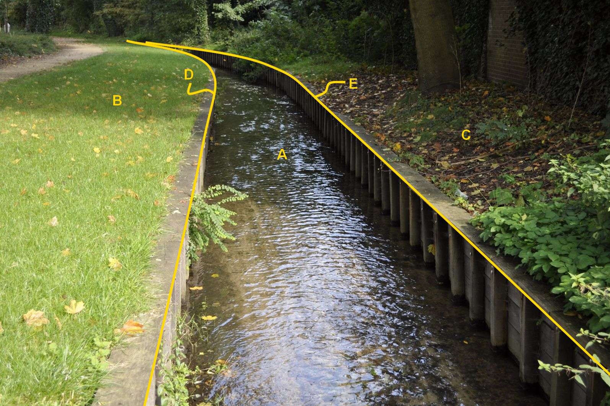

A:

|                        |                     |                 |
|------------------------|---------------------|-----------------|
| **Waterdeel**          | **Attribuutwaarde** | **Opmerkingen** |
| type                   | waterloop: beek     |                 |
| relatieveHoogteligging |                     |                 |
