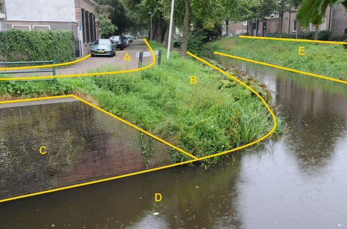

### Waterdeel, type: waterloop

D:

|                        |                     |                 |
|------------------------|---------------------|-----------------|
| **Waterdeel**          | **Attribuutwaarde** | **Opmerkingen** |
| type                   | waterloop           |                 |
| relatieveHoogteligging |  0                  |                 |

A: wegdeel, rijbaan: lokale weg, open verharding

B en E: ondersteunend waterdeel, oever/slootkant.

C: scheiding, kademuur.

Duikers vormen geen inhoud BGT.

F: Het niet zichtbare waterdeel in duiker is géén BGT-inhoud.
