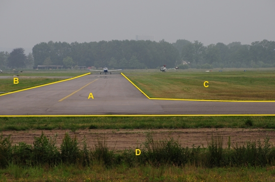

### Wegdeel, functie: baan voor vliegverkeer

A:

|                        |                        |                 |
|------------------------|------------------------|-----------------|
| **Wegdeel**            | **Attribuutwaarde**    | **Opmerkingen** |
| functie                | baan voor vliegverkeer |                 |
| fysiekVoorkomen        |  Gesloten verharding   |                 |
| relatieveHoogteligging |  0                     |                 |

B, C en D: Begroeid terreindeel, Grasland overig.
