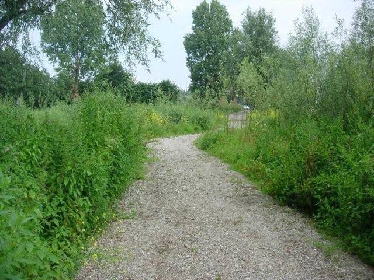

|                        |                     |                 |
|------------------------|---------------------|-----------------|
| **Wegdeel**            | **Attribuutwaarde** | **Opmerkingen** |
| functie                |                     |                 |
| fysiekVoorkomen        | half verhard: puin  |                 |
| relatieveHoogteligging |                     |                 |
