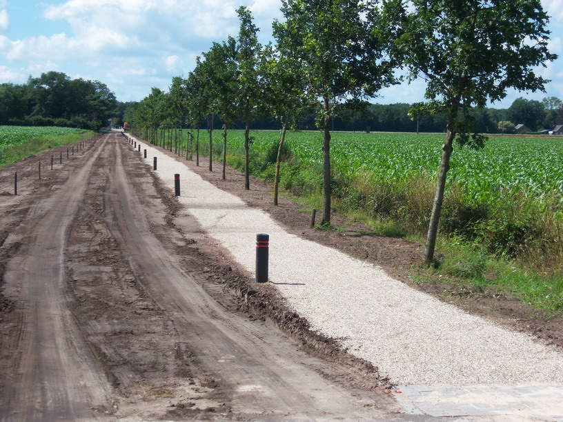

|                        |                        |                 |
|------------------------|------------------------|-----------------|
| **Wegdeel**            | **Attribuutwaarde**    | **Opmerkingen** |
| functie                |                        |                 |
| fysiekVoorkomen        | half verhard: schelpen |                 |
| relatieveHoogteligging |                        |                 |
