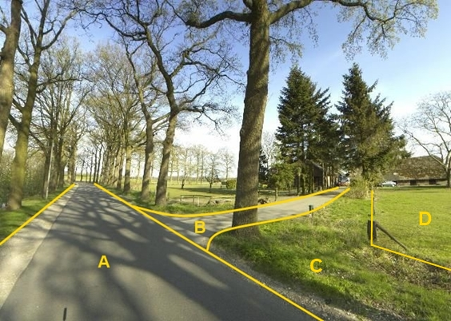

### Wegdeel, functie: inrit

B:

|                        |                      |                 |
|------------------------|----------------------|-----------------|
| **Wegdeel**            | **Attribuutwaarde**  | **Opmerkingen** |
| functie                | inrit                |                 |
| fysiekVoorkomen        |  Gesloten verharding |                 |
| relatieveHoogteligging |  0                   |                 |

A: Wegdeel, Rijbaan, Regionale weg, Gesloten verharding.

C: Ondersteunend wegdeel: Berm, fysiek voorkomen: Groenvoorziening.
