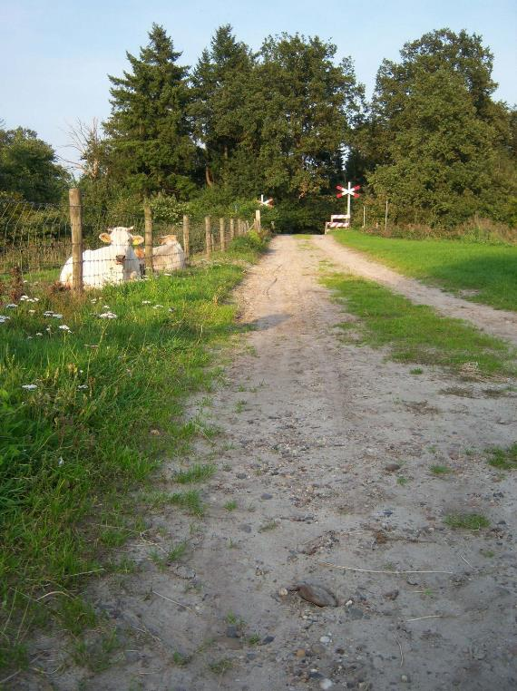

|                        |                     |                 |
|------------------------|---------------------|-----------------|
| **Wegdeel**            | **Attribuutwaarde** | **Opmerkingen** |
| functie                |                     |                 |
| fysiekVoorkomen        | onverhard: zand     |                 |
| relatieveHoogteligging |                     |                 |

# Ondersteunend wegdeel

In IMGeo kunnen bij ondersteunend wegdeel alle fysieke voorkomens worden toegekend zoals bij wegdeel, zie de paragrafen van 3.1.10 t/m 3.1.23, of een deel van de plustypen van begroeid terreindeel groenvoorziening, zie de paragrafen 3.5.12 t/m 3.5.17.

# Spoor
