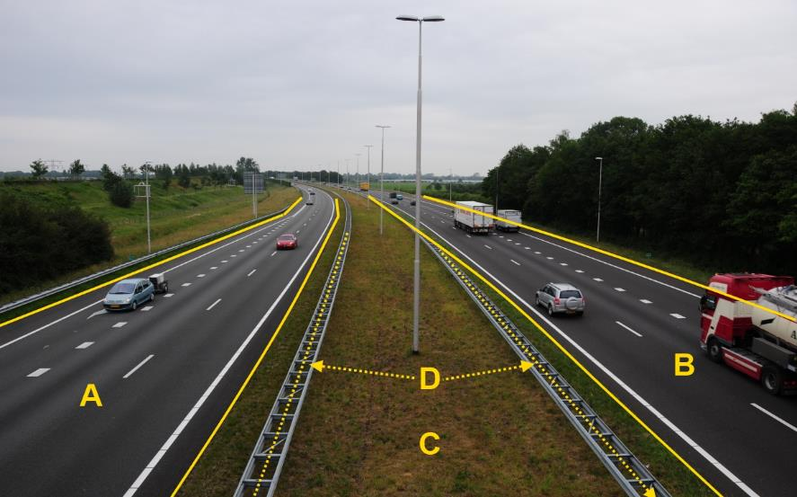

### Wegdeel, functie: rijbaan: autosnelweg

A en B:

|                        |                      |                 |
|------------------------|----------------------|-----------------|
| **Wegdeel**            | **Attribuutwaarde**  | **Opmerkingen** |
| Functie                | rijbaan: autosnelweg |                 |
| fysiekVoorkomen        |  Gesloten verharding |                 |
| relatieveHoogteligging |  0                   |                 |

C: Ondersteunend wegdeel: Berm, fysiek voorkomen: Groenvoorziening.

D (meerdere objecten): IMGeo: Type weginrichting, Geleideconstructie.
