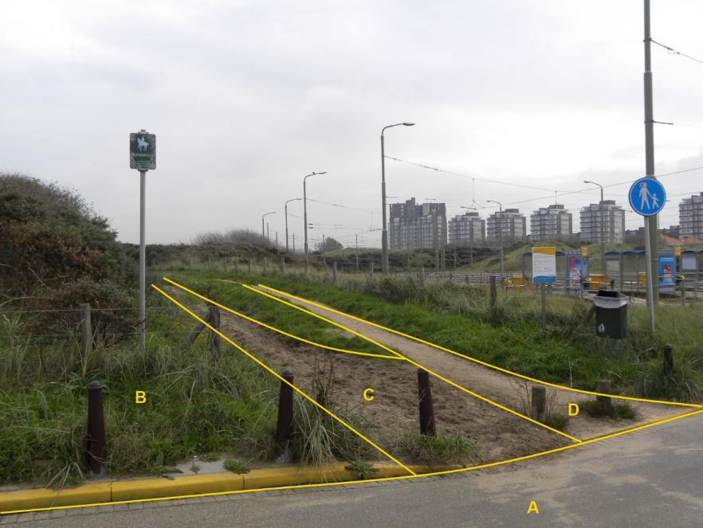

### Wegdeel, functie: ruiterpad

C:

|                        |                     |                 |
|------------------------|---------------------|-----------------|
| **Wegdeel**            | **Attribuutwaarde** | **Opmerkingen** |
| functie                | ruiterpad           |                 |
| fysiekVoorkomen        |  onverhard          |                 |
| relatieveHoogteligging |  0                  |                 |

A: Wegdeel, Rijbaan: Lokale weg, Gesloten verharding

B: Begroeid terreindeel, Duin.

D: Wegdeel, Voetpad, Half verhard.
