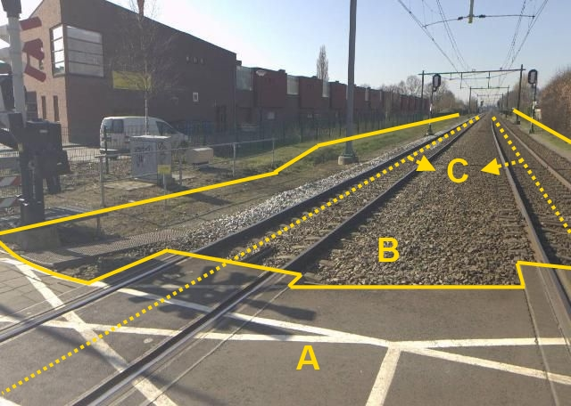

### Wegdeel, functie: spoorbaan

B:

|                        |                     |                 |
|------------------------|---------------------|-----------------|
| **Wegdeel**            | **Attribuutwaarde** | **Opmerkingen** |
| functie                | spoorbaan           |                 |
| fysiekVoorkomen        |  Half verhard       |                 |
| relatieveHoogteligging |  0                  |                 |

A: Wegdeel, Overweg.

C: Spoor, Trein.
