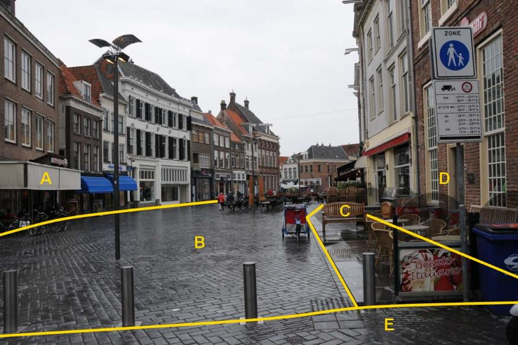

### Wegdeel, functie: voetgangersgebied

B en C:

|                        |                                    |                 |
|------------------------|------------------------------------|-----------------|
| **Wegdeel**            | **Attribuutwaarde**                | **Opmerkingen** |
| functie                | voetgangersgebied                  |                 |
| fysiekVoorkomen        |  B: open verharding, C: gesl.verh. |                 |
| relatieveHoogteligging |  0                                 |                 |

A en D: Pand

E: Wegdeel, Rijbaan: Lokale weg, Open verharding.
