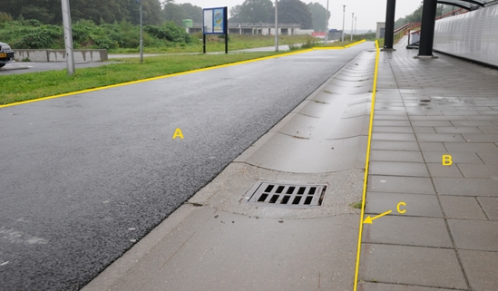

Voor de BGT is de molgoot geen inhoud en wordt bij wegdeel A gerekend. In IMGeo kan de molgoot als weginrichtingselement met lijngeometrie worden opgenomen.

C:

|                           |                     |                 |
|---------------------------|---------------------|-----------------|
| **Weginrichtingselement** | **Attribuutwaarde** | **Opmerkingen** |
| type                      | molgoot             |  lijn           |
| relatieveHoogteligging    |                     |                 |
