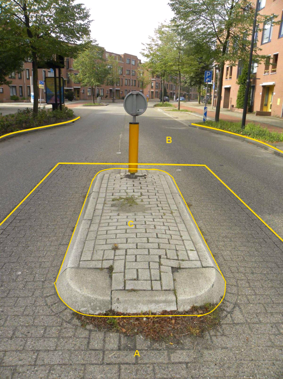

### OndersteunendWegdeel, functie: verkeerseiland

C:

 | ***OndersteunendWegdeel***  | ***Attribuutwaarde***  | ***Opmerkingen***|
 | ----------------------------| -----------------------| -------------------|
 | typeOndersteunendWegdeel    | Verkeerseiland         | |
 | fysiekVoorkomen             | Open verharding       |  |
|  relatieveHoogteligging      | 0                     |  |

A: Wegdeel, Rijbaan: Lokale weg, Open verharding.

B: Wegdeel, Rijbaan: Lokale weg, Gesloten verharding.

