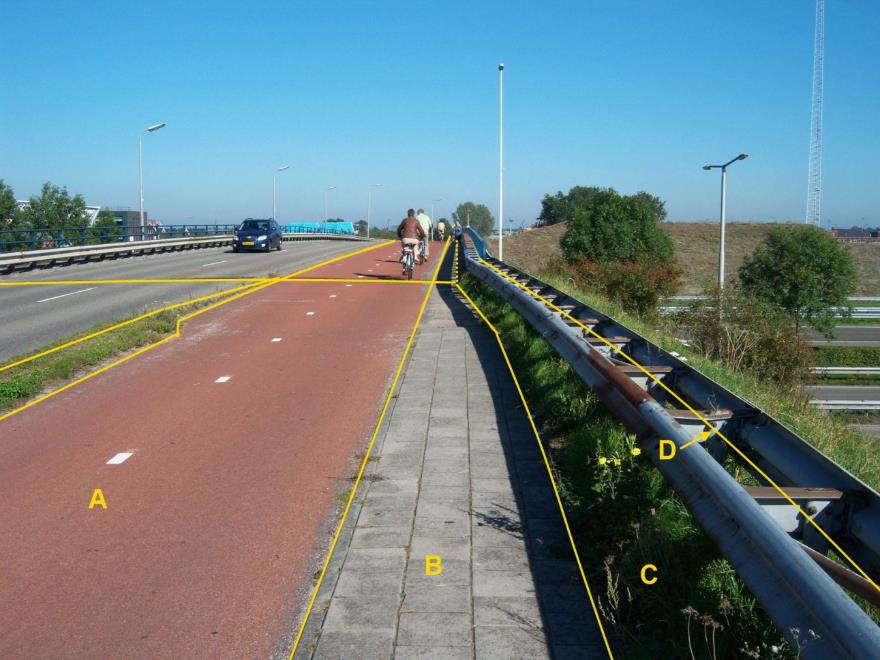
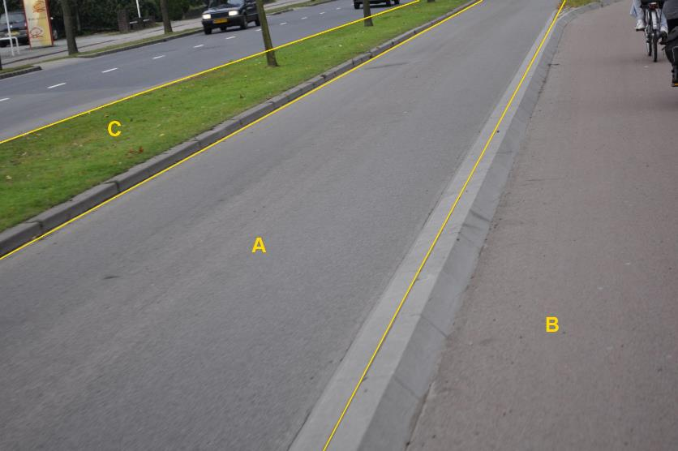
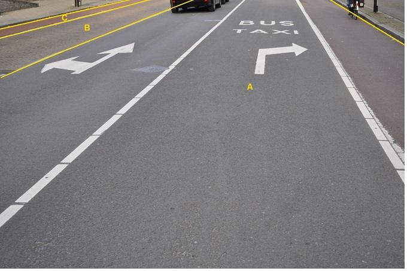

### Wegdeel, functie: fietspad

A:

  ------------------------ ---------------------- -----------------
  **Wegdeel**              **Attribuutwaarde**    **Opmerkingen**
  functie                  fietspad                
  fysiekVoorkomen           Gesloten verharding    
  relatieveHoogteligging    0                      
  ------------------------ ---------------------- -----------------

B: Wegdeel, Voetpad, Open verharding.

C: Ondersteunend wegdeel: Berm, fysiek voorkomen: Groenvoorziening.

D: IMGeo: Type weginrichting, Geleideconstructie.

Fietspad is afgescheiden van de rijbaan: lokale weg vanwege band.

B:

  ***Wegdeel***            ***Attribuutwaarde***   ***Opmerkingen***
  ------------------------ ----------------------- -------------------
  functieWeg               fietspad                
  fysiek voorkomen         Gesloten verharding     
  relatieveHoogteligging   0                       

A: Wegdeel, Rijbaan: lokale weg, Gesloten verharding.

C: Ondersteunend wegdeel: Berm, fysiek voorkomen: Groenvoorziening.

OV banen en fietspaden die zijn afgebakend door middel van belijning
en/of verkleuring vormen geen BGT inhoud en worden tot het wegdeel
rijbaan: lokale weg gerekend. Een wegdeel wordt uitsluitend als OV-baan
geclassificeerd als het alleen is bestemd voor openbaar vervoer en is
afgescheiden van de andere wegdelen niet uitsluitend door markering.

Wegdeel B heeft een andere fysiek voorkomen: open verharding.

A:

  ***Wegdeel***            ***Attribuutwaarde***   ***Opmerkingen***
  ------------------------ ----------------------- -------------------
  functieWeg               Rijbaan: lokale weg     
  fysiek voorkomen         Gesloten verharding     
  relatieveHoogteligging   0                       

