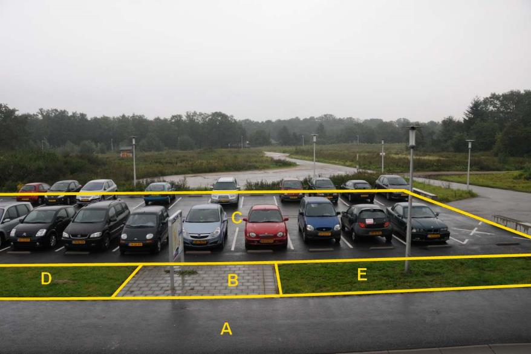
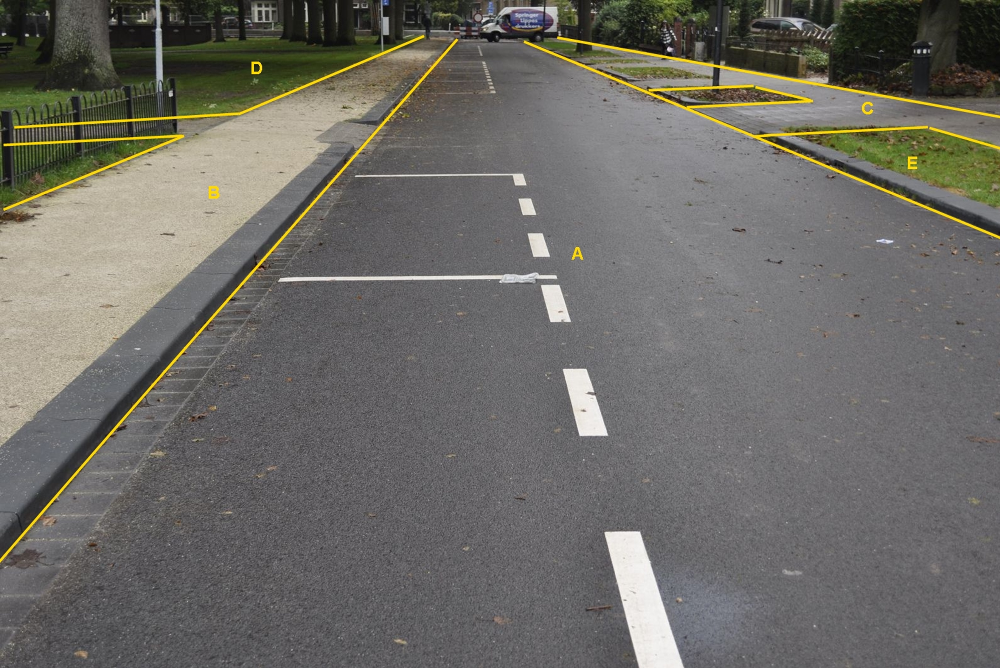

### Wegdeel, functie: parkeervlak

C:

  ------------------------ ---------------------- -----------------
  **Wegdeel**              **Attribuutwaarde**    **Opmerkingen**
  Functie                  parkeervlak             
  fysiekVoorkomen           Gesloten verharding    
  relatieveHoogteligging    0                      
  ------------------------ ---------------------- -----------------

A: Wegdeel, Fietspad, Gesloten verharding.

B: Wegdeel, Voetpad, Open verharding.

D en E: Ondersteunend wegdeel: Berm, fysiek voorkomen: Groenvoorziening.

Parkeervlakken die met belijning zijn afgebakend, vormen géén BGT
inhoud.

A:

  ***Wegdeel***            ***Attribuutwaarde***   ***Opmerkingen***
  ------------------------ ----------------------- -------------------
  functieWeg               Rijbaan: lokale weg     
  fysiek voorkomen         Gesloten verharding     
  relatieveHoogteligging   0                       

B en C: Wegdeel, Voetpad.

D: Begroeid terreindeel, Groenvoorziening.

E: Ondersteunend wegdeel: Berm, fysiek voorkomen: Groenvoorziening.

