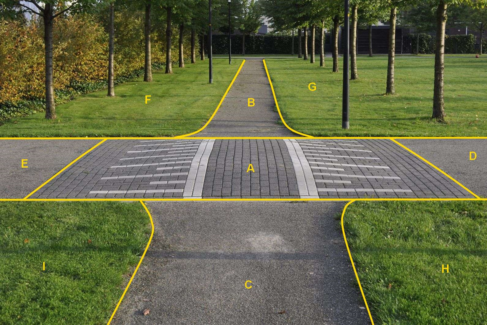

### Wegdeel, functie: rijbaan: lokale weg

A:

  ------------------------ ---------------------- -----------------
  **Wegdeel**              **Attribuutwaarde**    **Opmerkingen**
  functie                  rijbaan: lokale weg     
  fysiekVoorkomen           Gesloten verharding    
  relatieveHoogteligging    0                      
  ------------------------ ---------------------- -----------------

B: Wegdeel, Inrit.

C: Ondersteunend wegdeel: Berm, fysiek voorkomen: Groenvoorziening.

D: Begroeid terreindeel, Grasland agrarisch.

Het kruispunt, hier een verkeersdrempel, wordt niet apart ingewonnen
maar is wel zichtbaar omdat het een andere fysiek voorkomen heeft.

A:

  ***Wegdeel***            ***Attribuutwaarde***   ***Opmerkingen***
  ------------------------ ----------------------- -------------------
  functieWeg               Rijbaan: lokale weg     
  fysiek voorkomen         Open verharding         
  relatieveHoogteligging    0                      

B en C: Wegdeel, Fietspad, Gesloten verharding.

E en D: Wegdeel, Rijbaan: Regionale weg, Gesloten verharding.

F, G, H en I: Begroeid terreindeel, Groenvoorziening.

