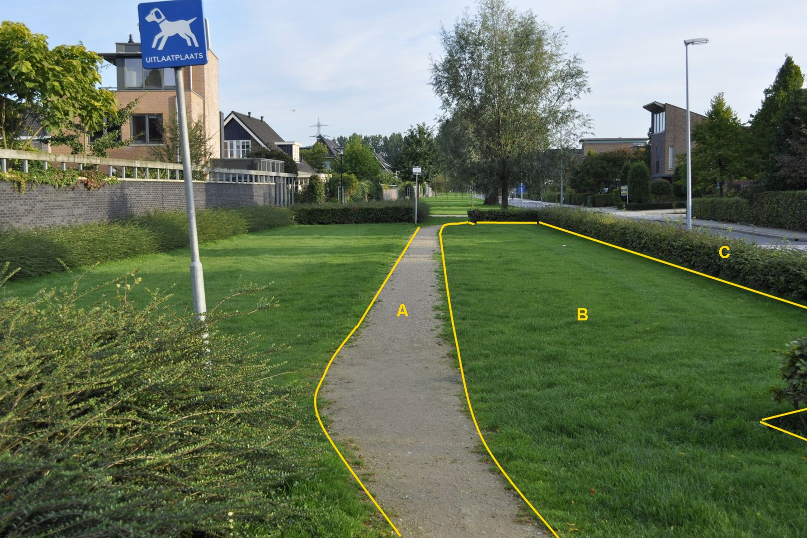
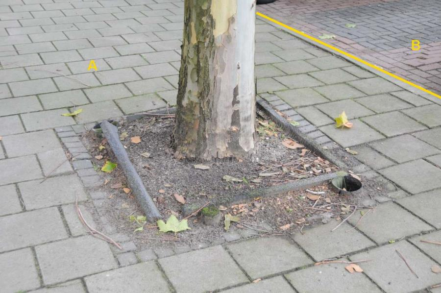
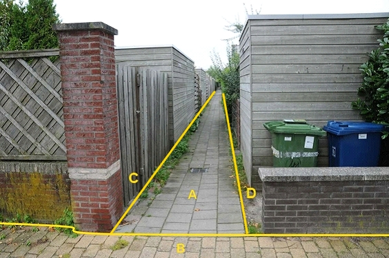

### Wegdeel, functie: voetpad

Voetpad is breder dan 0.30 m en wordt dus opgenomen.

Haag C wordt voor BGT niet geclassificeerd. Omdat het vak waarin de haag
staat groter is dan 5 m^2^ wordt het vak wel ingewonnen.

A:

  ------------------------ --------------------- -----------------
  **Wegdeel**              **Attribuutwaarde**   **Opmerkingen**
  Functie                  voetpad                
  fysiekVoorkomen           onverhard             
  relatieveHoogteligging    0                     
  ------------------------ --------------------- -----------------

B en C zijn voor de BGT beide: Begroeid terreindeel: Groenvoorziening.

C is voor IMGeo: Vegetatieobject: Haag.

B:

  ------------------------ --------------------- -----------------
  **Wegdeel**              **Attribuutwaarde**   **Opmerkingen**
  Functie                  voetpad                
  fysiekVoorkomen           Open verharding       
  relatieveHoogteligging    0                     
  ------------------------ --------------------- -----------------

A: Onbegroeid terreindeel: Open verharding.

C en D: Scheiding, Muur.

Plantvak met boomspiegel is geen BGT inhoud want het is \< 5 m^2^, A
loopt door.

A:

  ***Wegdeel***            ***Attribuutwaarde***   ***Opmerkingen***
  ------------------------ ----------------------- -------------------
  functieWeg               Voetpad                 
  fysiek voorkomen         Open verharding         
  relatieveHoogteligging    0                      

B: Wegdeel, Rijbaan: Lokale weg, Open verharding

A en B:

  ------------------------ --------------------- -----------------
  **Wegdeel**              **Attribuutwaarde**   **Opmerkingen**
  fysiekVoorkomen          voetpad                
  relatieveHoogteligging    0                     
  ------------------------ --------------------- -----------------

C en D: onbegroeid terreindeel, erf.

