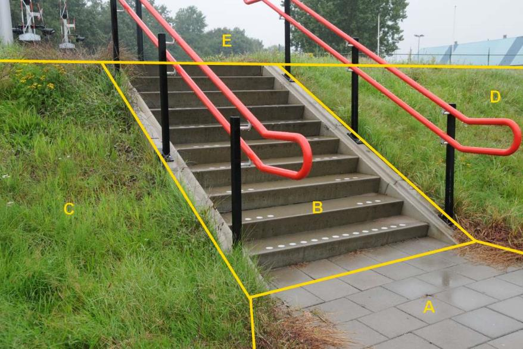

### Wegdeel, functie: voetpad op trap

B:

  ------------------------ --------------------- -----------------
  **Wegdeel**              **Attribuutwaarde**   **Opmerkingen**
  functie                  Voetpad op trap        
  relatieveHoogteligging     0                    
  ------------------------ --------------------- -----------------

A: wegdeel, voetpad.

C en D: Begroeid terreindeel, talud, kruinlijngeometrie, niveau 0.

