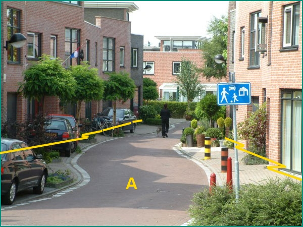

### Wegdeel, functie: woonerf

Het woonerf wordt hier begrensd door de panden en bevat geen
afzonderlijk voetpad.

A:

  ------------------------ --------------------- -----------------
  **Wegdeel**              **Attribuutwaarde**   **Opmerkingen**
  functie                  woonerf                
  fysiekVoorkomen           Open verharding       
  relatieveHoogteligging    0                     
  ------------------------ --------------------- -----------------

De perken met groenvoorziening zijn \< 5m^2^ en daarom eventueel IMGeo
inhoud.

