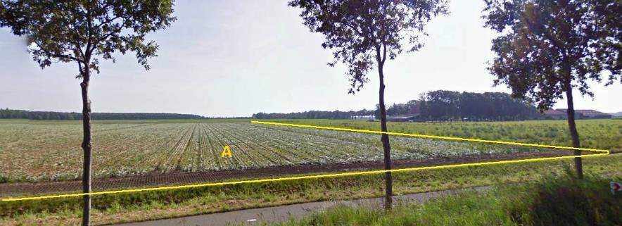
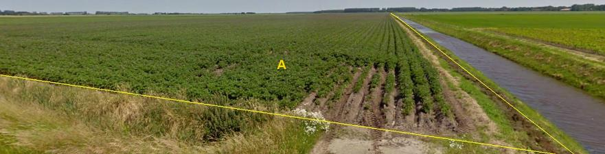

### BegroeidTerreindeel, fysiekVoorkomen: bouwland

A:

  ------------------------- --------------------- -----------------
  **BegroeidTerreindeel**   **Attribuutwaarde**   **Opmerkingen**
  fysiekVoorkomen           bouwland               
  relatieveHoogteligging     0                     
  ------------------------- --------------------- -----------------

