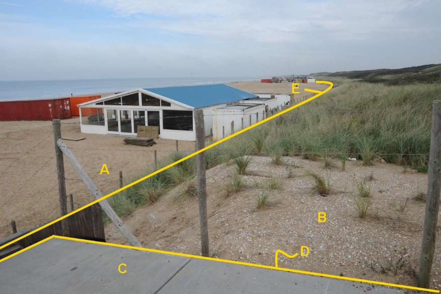

### BegroeidTerreindeel, fysiekVoorkomen: duin

B:

  ------------------------- --------------------- -----------------
  **BegroeidTerreindeel**   **Attribuutwaarde**   **Opmerkingen**
  fysiekVoorkomen           duin                   
  relatieveHoogteligging     0                     
  ------------------------- --------------------- -----------------

