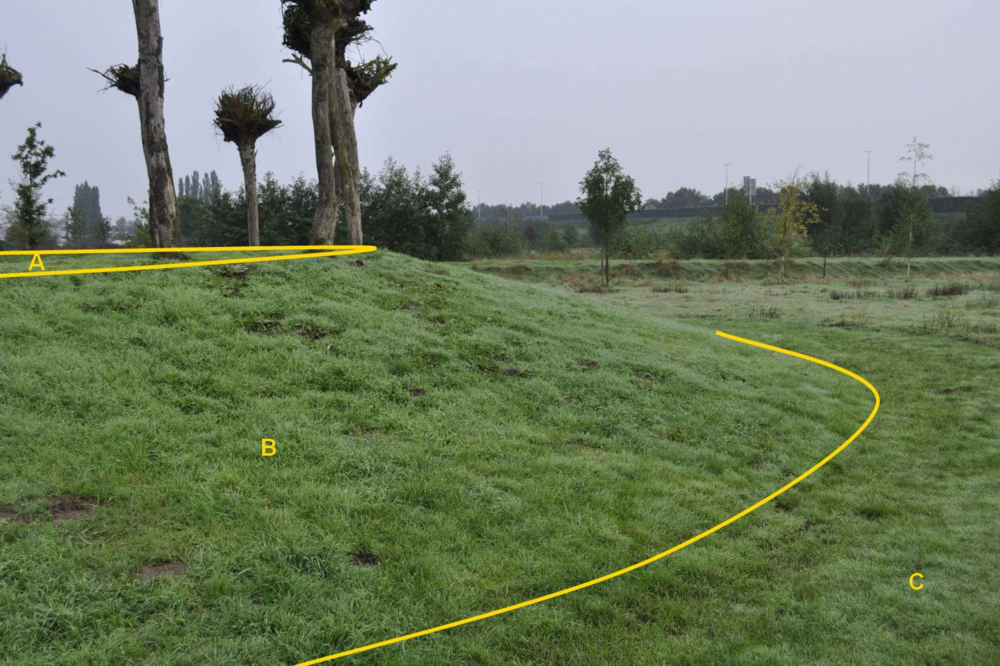

### **BegroeidTerreindeel, fysiekVoorkomen: grasland overig**

Grasland met een talud met kruinlijngeometrie

B:

  ***BegroeidTerreindeel***   ***Attribuutwaarde***   ***Opmerkingen***
  --------------------------- ----------------------- -------------------
  fysiekVoorkomen             Grasland overig         
  Talud                       ja                      
  Kruinlijngeometrie          ja                      
  relatieveHoogteligging       0                       

A en C: begroeid terreindeel, grasland overig.

