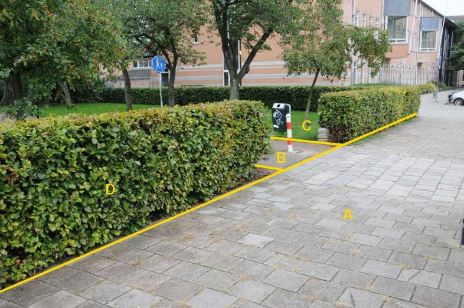
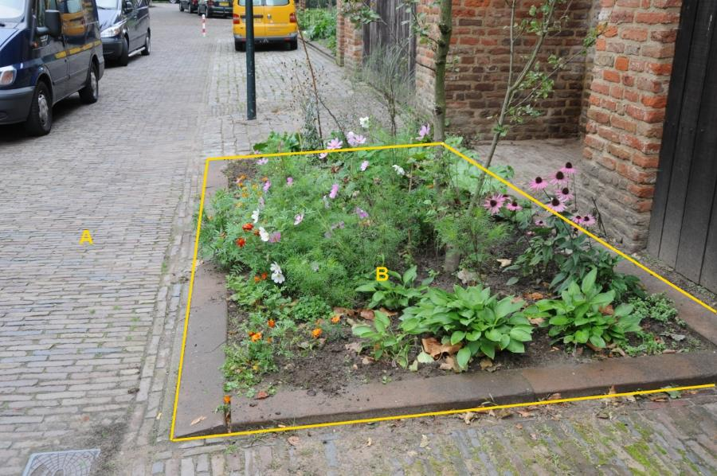

### BegroeidTerreindeel, fysiekVoorkomen: groenvoorziening

C en D (afzonderlijke objecten):

  ***BegroeidTerreindeel***   ***Attribuutwaarde***   ***Opmerkingen***
  --------------------------- ----------------------- -------------------
  fysiekVoorkomen             Groenvoorziening        
  relatieveHoogteligging       0                       

A en B: wegdeel, voetpad, open verharding.

B:

  ***BegroeidTerreindeel***   ***Attribuutwaarde***   ***Opmerkingen***
  --------------------------- ----------------------- ---------------------------------
  fysiekVoorkomen             Groenvoorziening        Plantvak opnemen want \> 5 m^2^
  relatieveHoogteligging       0                       

A: wegdeel, rijbaan: lokale weg, openverharding.

Objecttype: Waterdeel
---------------------

