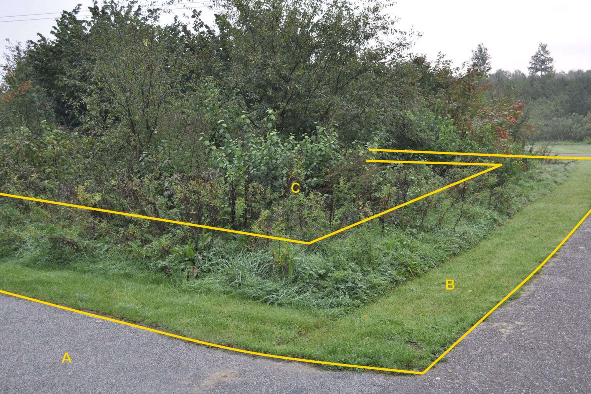

### BegroeidTerreindeel, fysiekVoorkomen: struiken

B is een ondersteunend wegdeel type berm, fysiek voorkomen
groenvoorziening.

C:

  ------------------------- --------------------- -----------------
  **BegroeidTerreindeel**   **Attribuutwaarde**   **Opmerkingen**
  fysiekVoorkomen           struiken               
  relatieveHoogteligging     0                     
  ------------------------- --------------------- -----------------

