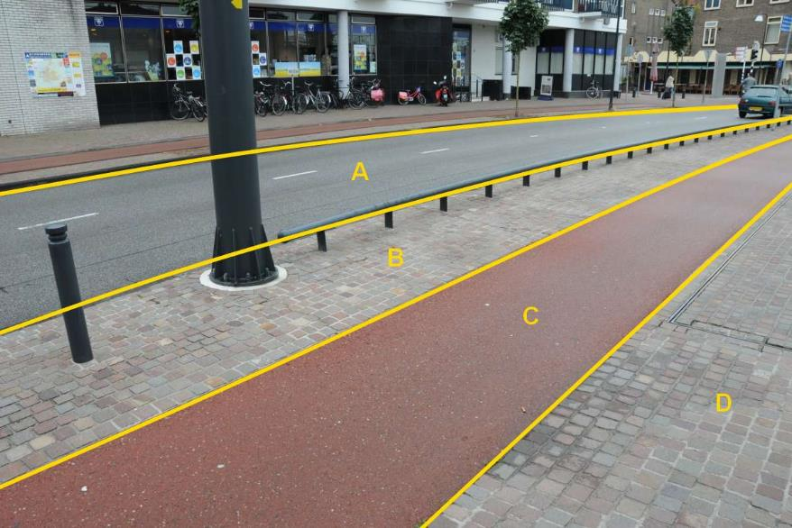

### OndersteunendWegdeel, functie: berm, fysiek voorkomen: open verharding

Het ondersteunend wegdeel Berm kent dezelfde waarden voor fysiek
voorkomen als geldt voor Wegdeel, aangevuld met de classificatie
groenvoorziening zoals voorkomt bij Begroeid terreindeel.

Niet van al deze mogelijke classificaties zijn fotovoorbeelden
opgenomen.

B:

  -------------------------- --------------------- -----------------
  **OndersteunendWegdeel**   **Attribuutwaarde**   **Opmerkingen**
  functie                    berm                   
  Fysiek voorkomen           open verharding       
  relatieveHoogteligging      0                     
  -------------------------- --------------------- -----------------

A: Wegdeel, Rijbaan: Lokale weg, Gesloten verharding.

C: Wegdeel, Fietspad, Wegdeel, Gesloten verharding.

D: Wegdeel, Voetpad, Open verharding.

